# Asp.NET - Asp.NET Core - Asp.NET Core 8.0

[TOC]


### Asp.NET Nedir?

- Microsoft tarafından geliştirilmiş bir Web Uygulama Geliştirme mimarisidir.

### Asp.Net Core Nedir?

- Microsoft tarafından geliştirilen ücretsiz ve açık kaynak (open source) Web Geliştirme Mimarisidir.
- Windows, Linux vs. Çalışır.
- Tüm Asp.NET altyapısı yeniden tasarlanmıştır.

### Asp.NET Core'un Asp.NET'ten Farkları

++ Performans

++ Cross Platform

++ Modüler altyapı

> Asp.NET'de bir bütün halinde iken, Core'da parça bütün ilişkisi daha efektiftir.

++ Bağımlılık Enjeksiyonu (DI)

++ Asenkron işlemler

++ Kolay bakım

++ Razor Pages


### Asp.NET Core 8.0

- Asp.NET Core'un günümüzdeki versiyonudur. -2026 Long Term Support version

- Bazı geliştirmelere sahiptir.

- Open API - SwaggerDoc

- Performans vs.


## Web Mantığı

### İnternette Gezerken Perde Arkası Nasıldır?

Tarayıcıda www.google.com'a girmek istediğimizde, adres satırına bunu giriyoruz ve enter'lıyoruz.
Bu durumda www.google.com için bir istek (request) sunucu tarafına iletiliyor. Geriye dönen tarayıcıda gördüğümüz alanda ise bir dönüt (response) elde ediyoruz.

Yani kısacası request-response mantığıyla hareket eder. Client, istemci, bir istek gönderir ve dönüt elde eder. Filtreleme, arama, tıklama, üzerinde gezme ve aklınıza gelebilecek bir çok aksiyonda bu senaryo tekrarlanır.


Request

- Artık bir web sitesinin açılması için yaptığımız eyleme girdik/tıkladık vs değil, istek gönderdik diyeceğiz!


### Temel Kavramlar

User, Client, Hosting, Ip, Domain, Request, Response

İsteği yapan bunun iradesine sahip olan kişi **User**, istemci (kumanda, browser, tablet, telefon, bilgisayar, isteği iletebilecek herşey) ise **Client**'dır.

**Hosting**, teorik anlamdaki internet ortamına erişime sahip web barındırma hizmetlerinin genel adıdır. Bu bizim kendi bilgisayarımız da olabilir, hosting firmaları tarafından hizmet sağlanan sunucu (server)'da olabilir. Elbette bunlar yerine günümüzde cloud sistemlerde kullanılabilir. (azure, amazon vs.)


Request: User'ın Client üzerinden sunucuya yaptığı istektir. Request içerisinde hangi adrese, ip'ye, domain'e istek gönderildiği bilgisi tutulur.

Response: Sunucu tarafından client'a dönülen cevaptır. Bu cevap server tarafında üretilen result'u barındıradabilir.


Internet Protocol (IP): Client'ların web üzerinden birbirleri ile iletişime geçmesinde kullanılan protokol neticesinde tahsis edilen adrestir. (12.345.678.90) gibi gibi..

Domain: Bu IP adreslerinin akılda kalıcılığını ve erişimini kolaylaştıran isimlendirmelerdir. Bu isimlendirmeler hosting firmaları tarafından tahisis edilir ve IP adresine yönlendirilir. Haliyle tarayıcıda (12.345.678.90) gibi IP adresi yazmak yerine, "www.google.com" domaini üzerinden erişim sağlayabilmekteyiz.


## HTTP Protokolü

Client ile server arasındaki haberleşmeyi sağlayan ilişki protokolüdür.

HTTP, client ile server arasındaki ilişkiyi 9 farklı fonksiyonlar gerçekleştirir.


### HTTP Fonksiyonları

- **Get** : Sunucudan veri(leri) listelemek, elde etmek için kullanılır. Verilere başka etkisi yoktur.
- Head
- **Post** : Sunucuya veri göndermek, eklemek için kullanılır.
- **Put ** : Var olan bir veriyi değiştirmek, güncellemek için kullanılır.
- **Delete** : Var olan veriyi silmek için kullanılır.
- Trace
- Options
- Correct
- **Patch** : Bir verinin bütününü değil, kısmi bir alanını güncelliyorsak eğer bu Patch isteğidir.


## Web Stratejisi

### Server

#### IIS

Internet Information Services (IIS) Asp.NET Core dahil olmak üzere web uygulamalarını barındırmak için esnek, güvenli ve yönetilebilir bir Web Sunucusudur.


#### Kestrel

Asp.NET Core uygulamaları dahili olarak gelen bir web sunucusudur.


#### Nginx

Ubuntu/Linux sistemlerde Asp.NET Core uygulamalarını çalıştırabilmemizi sağlayan bir sunucudur.

Reverse Proxy olarak Asp.NET Core uygulamalarındaki dahili sunucuyla(kestrel) işlevsellik gösterir.


#### Apache

Linux vs. gibi ortamlarda Apache ile Asp.NET Core uygulamalarını ayağa kaldırabilirsiniz.


#### Docker

Yazılım geliştiriciler ve sistem yöneticileri için geliştirilmiş açık kaynak olan bir yeni nesil sanallaştırma platformudur.


#### HTTP.sys

Yalnızca Windows üzerinde çalışan Asp.NET Core için bir web sunucusudur.
Kestrel'in bir alternatifidir.


## Web Geliştirme Modelleri

### Backend-Frontend Kavramları

Frontend : Veriyi anlamlı hale getiren, fakat veriyi üretmeyen kısımdır.

Backend : Veriyi üreten kısımdır.


Backend Server Side:

- Uygulamanın arkaplanı, mutfağıdır.
- Algotritmik ve mimarisel kodların yazıldığı alandır.
- Veritabanı işlemleri vs. backend'de gerçekleştirilir.
- Verinin/bilginin üretildiği yerdir.

Backend'de Kullanılan Teknolojiler:

- Node.JS
- PHP
- Ruby
- Java
- C#(.NET - Asp.NET Core)
- Python
- C++
- C
- Scala
- Golang

> Bir backend bazen başka bir backend'in frontend'i olabilir.


Frontend Client Side:

- Uygulamanın önyüzü, grafiksel arayüzüdür. (genellikle)
- Görsel kısmıdır. Makyajıdır.
- Backend'de üretilen veri Frontend'e gönderilir ve uygun şekilde kullanıcıya sunulur.

Frontend'de Kullanılan Teknolojiler

- Angular
- React
- Vue.Js
- Bootstrap
- Html
- Css
- JavaScript


## Web Uygulaması Geliştirme Yaklaşımları

### Olay Tabanlı Programlama Yaklaşımı

Olay güdümlü programlama veya Olay yönlendirmeli programlama da denmektedir.

- Programın akışını kullanıcı eylemlerine göre yönlendiren programlama yaklaşımıdır.

- Kullanıcı eylemlerine uygun bir şekilde olaylar tanımlanmıştır. Bu olay çalıştırılacak kodu barındırmaktadır.
- Uygulama hızlı bir şekilde inşa edilebilir. Lakin bakım ve sonraki gelişim süreci oldukça maliyetli olan bir yaklaşımdır.


### Model View Controller (MVC) Yaklaşımı

- MVC pattern'ını kullanan bir yaklaşımdır.
- Üretilen veri ile gösterim arasında bir soyutlamayı esas alınmıştır.
- MVC pattern'ı Microsoft tarafından üretilmemiştir. Böyle bir yanlış algı vardır.
- MVC, Microsoft'un kurulduğu yıllardan (1979 yılından) beri tasarlanmış bir kalıptır.


### API Yaklaşımı

- Application Programming Interface
- Web'de çalışabilen ve web uygulamaları, işletim sistemleri, veritabanları, donanımlar yahut yazılım kütüphaneleri ile iletişim kurabilen bir arayüzdür.
- Direkt olarak Web Uygulaması yaklaşımıdır diyemeyiz.
  Lakin genellikle web tabanlı uygulamalarda client ve server arasındaki iletişimi sağlayan bir sözleşme olarak kullanılmaktadır. Bu forma Web API ismi verilmektedir.


## MVC (Model - View - Controller)

Doğrudan MVC'ye geçmeden, öncelikle Asp.Net Core (Empty) proje oluşturarak dosyaları inceleyelim.

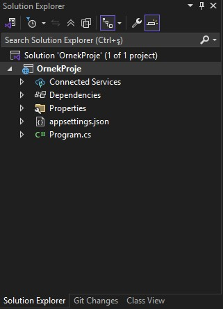

Asp.Net Core uygulamaları özünde bir console uygulamasıdır.
Program.cs dahili taşıdığı `kestrel` sunucusunu ayağa kaldırmak için `CreateBuilder()` metodunu çağırır.

.net 6.0'dan önce `CreateDefaultBuilder()` vardı ve bu default ayarları Startup.cs'den alıyordu.

**Asp.Net Core 5.0 Default Startup.cs Örneği:**

```csharp
namespace OrnekProje
{
    public class Startup
    {
        public void ConfigureServices(IServiceCollection service)
        {
            
        }
        public void Configure(IApplicationBuilder app, IWebHostEnviroment env)
        {
            if(env.IsDevelopment())
            {
                app.UseDeveloperExceptionPage();
            }
        	app.UseRouting();
            app.UseEndpoints(endpoints=>
            {
                 endpoints.MapGet("/", async context =>
                 {
                       await context.Response.WriteAsync("Hello World!");
                 })
             });
        }
    }
}
```

> ConfigureServices : Bu uygulamada kullanılacak servislerin eklendiği, konfigure edildiği metottur.
>
> Servis belirli işlere odaklanmış ve o işin sorumluluğunu üstlenmiş kütüphaneler/sınıflar/modüller vs..
>
> Configure : Bu metotta da uygulamada kullanılacak middleware/ ara katmanları / ara yazılımları çağırıyoruz.
>
> Biz bu ayarları artık Program.cs üzerinden aşağıdaki adımlarla gerçekleştireceğiz.

| ASP.NET Core 5    | ASP.NET Core 8               |
| ----------------- | ---------------------------- |
| CreateHostBuilder | WebApplication.CreateBuilder |
| Startup.cs        | Program.cs                   |
| ConfigureServices | builder.Services             |
| Configure         | app.Use / app.Map            |
| Dolaylı pipeline  | Açık ve okunur               |


**Asp.Net Core 8.0 Default Program.cs Örneği:**

```csharp
var builder = WebApplication.CreateBuilder(args);
var app = builder.Build();

app.MapGet("/", () => "Hello World!");

app.Run();
```


**appsettings.json**

Yazılımlarda bazen uygulamanın her yerinde kullanmak isteyeceğimiz metinsel değerler olabilir. (Örn: veri tabanı bağlantı metni)

Yazılımlarda kullanılması gereken statik olan metinsel değerler kodun içerisine yerleştirilmez. Çünkü gün gelir bu değer değiştirilmesi gerekirse eğer kodda her yerin düzeltilmesi gerekecektir. Bu durum bizim için maliyetli olacaktır. Böyle maliyetlerden kaçınabilmek için statik olan metinsel değerleri appsettings.json dosyasında tutmaktayız.


**appsettings.Development.json (6.0 öncesi)**

Geliştirme sürecinin farklı ortamlara göre Environment durumuna göre yayınlama (publish) veya geliştirme aşamalarında farklı değerlerle appsettings'de olduğu gibi statik olan metinsel değerleri tutabilmekteyiz.


**Properties**

Çift tıkladığımızda projenin özelliklerine dair ayarlamaları yapabildiğimiz, içerisindeki **launchSettings.json** ile Debug ayarları ilişkili bir şekilde çalışmaktadır.


**Dependencies**

Core'dan önce references vardı, artık bunlar artık (bağımlılık) dependencies oldu. Uygulamada kullandığımız dahili ve harici kütüphaneleri barındırır.


Environment konusunu ilerde ele alacağız ve appsettings, properties/launchSettings detaylarını bu başlık altında inceleyeceğiz.


Proje default olarak kestrel ile ayağa kalkmaktadır. Görselde gördüğünüz üzere IIS Express ile de ayağa kaldırabilmekteyiz.

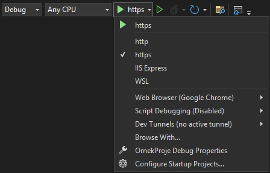

----


MVC, birbirinden bağımsız üç katmanı esas alan bir Mimarisel Desen (Architectural Pattern)'dir.

Özünde Observer, Decorator gibi design pattern'ları kullanan bir mimarisel desendir.

Microsoft bu desen üzerine oturtulmuş Asp.NET Core MVC mimarisini geliştirmiştir.


### Model

İşlenecek olan veriyi temsil eden katmandır. Genellikle veri tabanı işlemlerinin yapıldığı katmandır.

`Entity Framework Core, Entity Models, Ado.NET, Repository, Veritabanı İşlemleri`


### View

İstek neticesinde elde edilen verileri görselleştirecek, görsel çıktısını verecek katmandır.

`HTML, CSS, JavaScript, Razor, Resim, Müzik, Video`


### Controller

Gelen request'leri karşılayacak olan ve request'in içeriğine göre gerekli model işlemlerini üstlenecek olan katmandır.
Algoritmaları, servisleri, veri tabanını vs. çağırarak/çalıştırarak/sorgulayarak istenilen veriyi üretmekten ve ihtiyaç dahilinde üretilen bu veriyi View ile görselleştirmekten sorumludur.
İstek neticesinde elde edilen ve işlenen veriyi tekrardan client'a response olarak döndürür.


[Asp.Net Core 5.0 - MVC Nedir? Asp.NET Core MVC Pipeline'ı Nasıldır? 10:26](https://youtu.be/RHDC0i9MZzM?list=PLQVXoXFVVtp33KHoTkWklAo72l5bcjPVL&t=627)


User Client aracılığıyla request(istek) gönderir
Controller eğer veri tabanına ihtiyacımız varsa.. veriler dış kaynaktan alınacaksa.. yahut bir model kullanacaksa.. model'a yönelir.

Modeldeki veri Controller'a döner ve ilgili veri görselleştirilecekse controller üzerinden view'de görselleştirilir/görüntülenir.

Eğer veri tabanına ihtiyacımız yoksa.. veriler dış kaynaktan alınmayacaksa.. yahut bir model kullanılmayacaksa..  Controller model'i veya view'i kullanmaz.


İstek gönderildiğinde, kestrel/IIS veya hangi sunucuysa bu isteği alır, middleware'e yönlendirir. Ara yazılım varsa bunlar çalışır ardından routing ile devam eder.
Routing isteğin mahiyetine göre ilgili controller'i ayağa kaldırır. Controller action method tetiklenir, result üretilir ve gerekirse view render edilir ve response döner.
View render edilmeden de saf veriyi response edebilir.


----

## MVC Proje Altyapısı Oluşturma ve Temel Konfigürasyonları Sağlama

Asp.Net Core 8.0 (empty) bir solution oluşturuyoruz. Visual Studio bizlere default yapılanmayı getiriyor.

MVC bir modül olarak eklenecektir. Asp.Net Core 5.0'da bu işlem `startup.cs`'deki `ConfigureServices()` metodu ile başlayacakken 8.0'a göre bizler `program.cs` ile devam edeceğiz.

### Program.cs

```csharp
var builder = WebApplication.CreateBuilder(args);

// ========== ConfigureServices ==========
/* Asp.NET Core uygulamasında MVC mimarisini kullanabilmek için uygulamada Controller ve View yapılanmasının eklenmesi gerekmektedir. Bunun için öncelikle bu servis uygulamaya ekleniyor. Böylece uygulama MVC davranışı sergileyecektir.
*/
builder.Services.AddControllersWithViews();

var app = builder.Build();

// ========== Configure =========/
// Middleware
if (!app.Environment.IsDevelopment())
{
    app.UseExceptionHandler("/Home/Error");
    app.UseHsts();
}

app.UseHttpsRedirection();
app.UseStaticFiles();
// Gelen isteğin rotası bu middleware sayesinde belirlenir.
app.UseRouting();

app.UseAuthorization();

/*
Endpoint:
Yapılan isteğin varış noktasıdır (URL).
Uygulamaya gelen HTTP isteklerinin hangi controller/action
ya da minimal endpoint'lere yönlendirileceğini burada bildiririz.

ASP.NET Core 6+ ile birlikte UseEndpoints yerine
Map* metodları (MapGet, MapControllers, MapDefaultControllerRoute)
kullanılmaktadır.
*/
// Minimal API
app.MapGet("/hello", () => "Hello World!");

// MVC default endpoint
/* 
Bu uygulamaya yapılacak istekler, bu şemaya uygun bir şekilde yapılacaktır.
[controller=Home]/[action=Index]/[id?] default olan endpoint şeması
örn. https://www.example.com/personel/getir/3 dediğimizde personel controller'ı altında getir action'u 3 id değeriyle tetiklenir.
Controller boş geliyorsa HomeController, Action boş geliyorsa Index aksiyonu tetiklenmesi üzerine ilgili sayfa gelecektir.
*/
app.MapDefaultControllerRoute();

/*
Endpoint tanımlamasında süslü parantez içerisinde parametre tanımlanabilmektedir. Bu parametreler herhangi bir isimde olabilir.
örn.
{controller}/{action}/{hilmi}
controller ve action -> ön tanımlı olan parametrelerdir.
*/
app.Run();
```


Temel mvc yapılanmasını yaptıktan sonra, gelen istekleri karşılayabilecek controller tasarlamamız gerekiyor.


### Controller

Uygulamaya gelen istekleri karşılayabilmek için kullandığımız sınıflardır.

Kök dizinde bulunmayacağı için, Controller sınıfları genellikle Controllers klasörü altında tutulurlar.

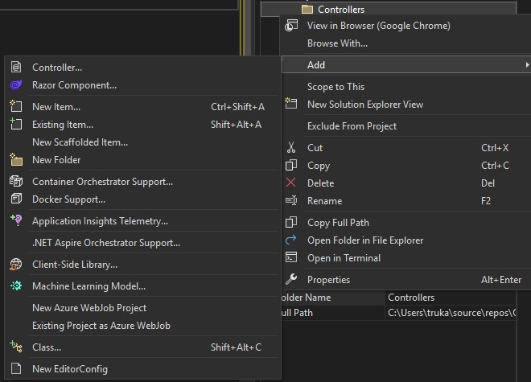

`Add > Controller > Empty` diyerek boş bir controller oluşturalım.

İsmi default olarak her zaman `HomeController.cs` olarak gelecektir. Biz ise `PersonelController.cs` gibi bunları belirleyeceğiz.

> Controller sınıflarının isimlerinin sonuna Controller eki koyulması gelenekseldir. Interfacelerin başına 'I' , Delegatelerin sonuna Handler, asenkron fonksiyonların sonuna Async koyduğumuz gibi..

---

Controller her ne kadar adı Controller olsa da özünde bir class'tır. 

`public class HomeController : Controller`

Bir sınıfı request alabilir ve response döndürebilir yani controller yapabilmek için o sınıfı controller class'ından türetmemiz gerekmektedir.


#### Controller sınıfı

Genel olarak baktığımızda, ilgili sınıfa view ile iletişim kurabileceğimiz fonksiyonlarımız mevcut. Veri taşıma kontrollerimiz mevcut, yani view'e veri taşımamızı sağlayan kontroller kazandırmaktadır.


#### ControllerBase sınıfı

İlgili request ile alakalı bilgiler getiren, response'a ulaşmamızı sağlayan, modestate'ini getiren, url ile ilgili değerler getiren vesaire, yani gelen request üzerinde bütün dataları bize getirecek ve response ile ilgili konfigürasyonları yapmamızı sağlayacak bir sınıftır.

---

`Add > Controller > Empty` diyerek boş bir controller oluşturalım. İsmi `ProductController` olsun.
Buradaki Index action'unun adını GetProducts olarak değiştirelim.

---

Controller sınıfları içerisinde, istekleri karşılayan metotlara action metot denir.

Controller sınıfları içerisinde tanımlanan tüm metotlar artık action metot olarak nitelendirilecektir.

Action metot : Controller'a gelen isteği karşılayan ve gerekli operasyonları gerçekleştiren metotlardır.

---

Runtime'da kontrol etmek için ilgili action'lara breakpoint atarak çalıştıralım.

Farkederseniz, biz `program.cs` içerisinde `MapDefaultControllerRoute` tanımlamıştık, haliyle Home/Index default olarak tetiklenecektir.
Eğer ki biz url'e `/Product/GetProducts` yazarsak, bu seferde bu action tetiklenecektir. Breakpoint'i devam ettirirseniz aşağıdaki sayfa gelecektir.

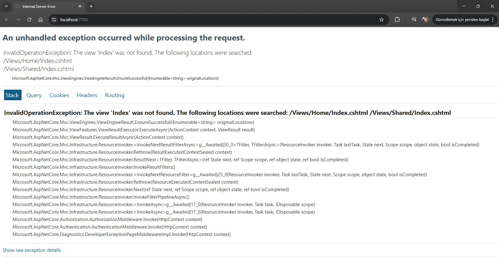

Bu exception sayfasının gelme sebebi, henüz ilgili view'i oluşturmamış olmamız. Haliyle view oluşturarak devam edeceğiz.

---


### Views

Projemizin içerisine Controller'da olduğu gibi Views klasörü oluşturuyoruz.

Bir controller'a ait ilgili view'lerin hepsi, controller adı altında yer alması gerekiyor. Dolayısıyla Views klasörü altında Home ve Product klasörleri oluşturacağız.

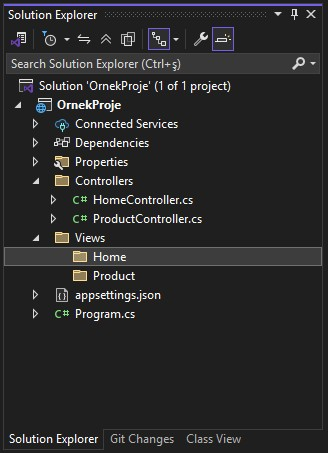

Her controller için ilgili klasörü oluşturduktan sonra sağ tıkla `Add>View>Razor View` seçeceğiz.

`Razor View` veya `Razor View -Empty` farketmez. Biri boş biri dolu view oluşturulur. İsim verirkende action'umuzun adını yazacağız.
Index, GetProducts gibi..

> Buradaki isimlendirmeler önemli, çünkü mimari Views klasörü içerisinde controller adı altındaki ilgili action adını biliyor. Dolayısıyla farklı isimlendirmelere gidilmesi, Route yapısında özel tanım gerektirmektedir.

View dediğimiz yapı, görüldüğü üzere .cshtml uzantılı dosyalardır.

> cshtml : cs dosyaları ile html dosyalarının birlikte kullanılabildiği bir format demektir. Biz bu formata Razor teknolojisi diyeceğiz.
> cs + html = cshtml => razor 
>
> Razor, html içerisinde C# kodlarını yazmamızı sağlayan bir teknolojidir.

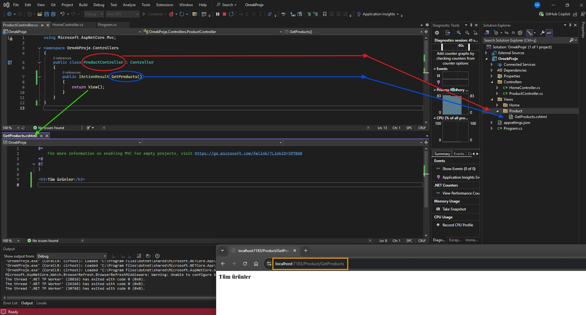

Kullanıcı tarafından `/Product/GetProdutcs` requesti geldiğinde,
Controller bu requesti alıp ilgili action metodunu tetikler. Haliyle Controller önce Views içerisinde Product klasörüne gider, ardından GetProducts.cshtml'i çağırır. Elde ettiği view'i return eder, yani view dosyasını render etmesi demektir.
Bu return işlemi response olarak client'a gönderilir.

> Client kavramını, web mantığı başlığı altında ele almıştık.
> Genel olarak bu durumda istemci, tarayıcı, web browserdir.

View fonksiyonu bu action'a ait view(.cshtml) dosyasını tetikleyecek olan fonksiyondur.

> Hatta `return View()` yerine daha öncesinde `ViewResult result = View()` tanımlayıp result'u return edebiliriz.
>
> Ayrıca View metodu içerisinde parametre alabilir ilgili .cshtml'e gider, makyaj yapılmış hali ile geri döner.


`View()` metodunu kullanmadığımız senaryoları da ilerleyen konu başlıkları altında ele alacağız.


İlla burada GetProducts değil, farklı bir isimde view dosyası ile çalışacağım diyecek olursak;

```csharp
public IActionResult GetProducts()
{
    //ViewResult result = View(); --> İlgili action ismiyle birebir aynı olan viewi tetikler.
    ViewResult result = View("Index"); // --> Belirtilen view ismindeki view dosyasını render eder.
    return result;
}
```


### Model

Model katmanı da yine dizinde Models klasörü altında tutulur. İsminin Models olması şart değildir, ayrıca veri tabanı işlemleri olmak zorunda da değildir.

Pipeline'da bahsettiğimiz üzere model'da işlem yaparken, controller requesti alır, ilgili action tetiklenir, controller model'a gider ve veriyi getirir.
Controller <---> model ilişkisi aşağıdaki gibi gösterilebilir.

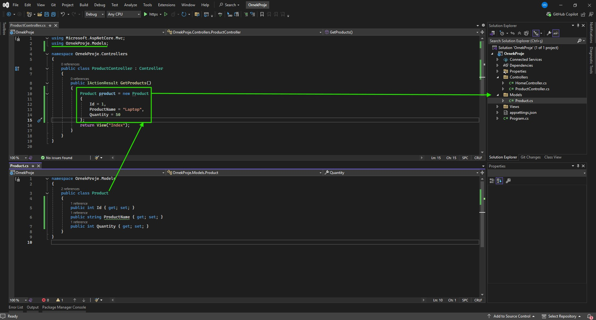

MVC'de stratejik olarak model'a gitmiş gibi görünsekte, esasında sadece oradaki sınıfları kullanmaktan ibarettir.


---


## Action Türleri Nelerdir? (Action Types)

Client'dan gelen request neticesinde bu request'i karşılayan Controller sınıfının içerisinde gerekli aksiyonu almamızı sağlayan action fonksiyonları üzerine inceleme yapacağız, action fonksiyonlarının birden fazla dönüş türü var bunları ele alacağız.

Bu fonksiyonlar kalıtım aldığımız Controller sınıfının bize sağlamış olduğu fonksiyonlardır.

`ViewResult, PartialViewResult, JsonResult, EmptyResult, ContentResult, ActionResult, IActionResult`

### ViewResult

Response olarak bir View dosyasını (.cshtml) render etmemizi sağlayan action türüdür.

```csharp
public IActionResult Index()
{
    ViewResult result = new View();
    return result;
}
```


### PartialViewResult

Yine bir View dosyasını (.cshtml) render etmemizi sağlayan bir action türüdür.

ViewResult'tan temel farkı, client tabanlı yapılan Ajax isteklerinde kullanıma yatkın olmasıdır.

Teknik fark ise ViewResult _ViewStart.cshtml dosyasını baz alır. Lakin PartialViewResult ise ilgili dosyayı baz almadan render edilir.

> Sayfayı yenilemeden, sadece bir parçasını değiştirmek adına PartialViewResult ile işlem gerçekleştiririz.

```csharp
public PartialViewResult GetProducts()
{
    PartialViewResult result = PartialView();
    return result;
}
```


### JsonResult

Üretilen datayı JSON türünde dönüştürüp döndüren bir action türüdür.

```csharp
public JsonResult GetProducts()
{
    JsonResult result = Json(new Product{
        Id = 5,
        ProductName = "Terlik",
        Quantity = "12",
    });
    return result;
}
```


### EmptyResult

Bazen gelen istekler neticesinde herhangi bir şey döndürmek istemeyebiliriz. Böyle bir durumda EmptyResult action türü kullanılabilir.

```csharp
public EmptyResult GetProducts()
{
    return new EmptyResult();
}
//public void GetProducts() ile de aynı işlem yapılabilmektedir.
```

> Response döndürür lakin result döndürmez.


### ContentResult

İstek neticesinde cevap olarak metinsel bir değer döndürmemizi sağlayan action türüdür.

```csharp
public ContentResult GetProducts()
{
    ContentResult result = Content("Sebepsiz boş yere ayrılacaksan..");
    return result;
}
```

> Sonucu sayfaya html olarak değil, text formatında döndürür.


### ViewComponentResult

> İsteğe cevap olarak bir ViewComponent render etmemizi sağlayan action türüdür.
>
> Modüler tasarım yapılanması başlığında ne olduğunu daha detaylı inceliyor olacağız.


### ActionResult

Gelen bir istek neticesinde geriye döndürülecek action türleri değişkenlik gösterebildiği durumlarda kullanılan bir action türüdür.

ActionResult, tüm action türlerini karşılayan ana türdür.

```csharp
public ActionResult GetProducts()
{
    if (true)
    {
        //...
        return Json(new object());
    }
    else if (true)
    {
        return Content("başarılı");
    }
    else if (true)
    {
        return PartialView();
    }
    else
    {
        return new EmptyResult();
    }
}
```


### IActionResult

ActionResult'un arayüz halidir. Ortak tür sağlamak, polimorfizm kurallarına dayanarak çalışma sergilemek istiyorsanız ActionResult/ IActionResult kullanabilirsiniz.


### NonAction ve NonController Attributeları

Controller'ların içerisinde kesinlikle iş mantığı olmamalıdır. Controller sadece ilgili requesti alıp, response döndürmelidir.
İş mantıkları başka sınıflarda, başka katmanlarda, başka servislerde, başka API'lerde gerçekleştirilmelidir.

Action'larda iş yapmaz, iş yapan sınıfları, servisleri çağırmak için vardır.

Eğer ki bir ihtiyacımız bir controller sınıfı içerisinde iş mantığı yürüten metotsa ki bu tavsiye edilmez, bu metodun request alınmasını engellemek ve sadece iş mantığı yürüttüğünü belirtmek için `[NonAction]` attribute'u ile işaretlenir.

```csharp
public IActionResult Index()
{
    X();
    return View();
}
[NonAction] //Controller içerisinde NonAction attribute'u ile işaretlenen fonksiyonlar dışarıdan request karşılamazlar.
public void X()
{
    
}
```


Sistemde varolan bütün Controller'lar dışarıdan request alabilmektedirler, hem controller tanımlayıp hem request almasını istemiyorsanız, `NonController` attribute'u tanımlamalısınız.

---


## View Yapılanması ve View'e Veri Taşıma Kontrolleri

Controllerdan View'e nasıl veri taşıyacağımızı ele alacağız, bunu 4 farklı şekilde gerçekleştirebilmekteyiz.

### `Model Bazlı Veri Gönderimi`

```cs
public class ProductController : Controller
{
    public IActionResult Index()
    {
        var products = new List<Product>
        {
            new Product{ Id = 1, ProductName = "A Product", Quantity = 10 },
            new Product{ Id = 2, ProductName = "B Product", Quantity = 15 },
            new Product{ Id = 3, ProductName = "C Product", Quantity = 20 }
        }
        return View(products); // --> Burada products boxing edilir ve view'e gönderilir.
    }
}
```

Tabii model bazlı veri gönderimini View'in karşılayabilmesi için bunu da .cshtml içerisinde belirtmemiz gerekmektedir.

`@model`: Referans
`@Model`: Data

```html
@model List<OrnekProje.Models.Product>

<ul>
	@foreach (var product in Model)
	{
		<li>@product.ProductName</li>
	}
</ul>
```


### `Veri Taşıma Kontrolleri`

#### ViewBag

View'e gönderilecek/taşınacak datayı dynamic şekilde tanımlanan bir değişkenle taşımamızı sağlayan bir veri taşıma kontrolüdür.

Action içerisinde:
```csharp
public class ProductController : Controller
{
    public IActionResult Index()
    {
        var products = new List<Product>
        {
            new Product{ Id = 1, ProductName = "A Product", Quantity = 10 },
            new Product{ Id = 2, ProductName = "B Product", Quantity = 15 },
            new Product{ Id = 3, ProductName = "C Product", Quantity = 20 }
        }
        ViewBag.products = products; //ViewBag burada dynamic şekilde products'ı alır.
        return View();
    }
}
```

View içerisinde:
```html
<ul>
	@foreach (var product in ViewBag.products as List<OrnekProje.Models.Product>) // Dynamic olduğu için türü runtime'da belirlenir
	{
		<li>@product.ProductName</li>
	}
</ul>
```


#### ViewData

ViewBag'de olduğu gibi actiondaki datayı view'e taşımamızı sağlayan bir kontroldür. ViewBag dynamic ile veriyi taşırken, ViewData veriyi boxing ederek taşır.

```csharp
public class ProductController : Controller
{
    public IActionResult Index()
    {
        var products = new List<Product>
        {
            new Product{ Id = 1, ProductName = "A Product", Quantity = 10 },
            new Product{ Id = 2, ProductName = "B Product", Quantity = 15 },
            new Product{ Id = 3, ProductName = "C Product", Quantity = 20 }
        }
        ViewData["products"] = products;
        return View();
    }
}
```

```html
<ul>
	@foreach (var product in ViewData["products"] as List<OrnekProje.Models.Product>) // Boxing edilerek geldiği için as ile veya cast operatörüyle unboxing edilmesi gerekmektedir.
	{
		<li>@product.ProductName</li>
	}
</ul>
```


#### TempData

ViewData'da olduğu gibi actiondaki datayı view'e taşımamızı sağlayan bir kontroldür. Bir actionda kullandığımız datayı farklı bir actiona göndermemiz gerektiği durumlarda kullanılır. Tarayıcıda Cookies içerisinde bu datayı tutar.

```csharp
public class ProductController : Controller
{
    public IActionResult Index()
    {
        ViewBag.x = 5;
        ViewData["x"] = 5;
        TempData["x"] = 5;
        return RedirectToAction("Index2");
    }
    public IActionResult Index2()
    {
        var v1 = ViewBag.x;
        var v2 = ViewData["x"];
        var v3 = TempData["x"];
        return View(); // --> Buraya breakpoint atıp çalıştırın.
    }
}
```

> ComplexType verileri aksiyonlar arası taşırken Serialize etmemiz gerekmektedir. Aksi halde hata ile karşılaşırız.

```csharp
public class ProductController : Controller
{
    public IActionResult Index()
    {
        var products = new List<Product>
        {
            new Product{ Id = 1, ProductName = "A Product", Quantity = 10 },
            new Product{ Id = 2, ProductName = "B Product", Quantity = 15 },
            new Product{ Id = 3, ProductName = "C Product", Quantity = 20 }
        }
        
        string data = JsonSerializer.Serialize(products);
        TempData["products"] = data;
        
        return RedirectToAction("Index2");
    }
    public IActionResult Index2()
    {
        var data = TempData["products"].ToString(); //Serialize edilen veriyi tekrar deserialize etmemiz gerekir.
        List<Product> products = JsonSerializer.Deserialize<List<Product>>(data);
        return View();
    }
}
```


#### View'e Tuple Nesne Gönderimi ve Kullanımı

Elimizdeki birden fazla veriyi syntax'ta olan Tuple nesnesi olarak veya ViewModel ile nasıl gönderebildiğimizi inceleyelim.


###### ViewModel ile View'e Nesne Gönderimi

`Models` klasörü altına `ViewModels`klasörü açıyoruz ve altına `UserProduct.cs` sınıfı oluşturuyoruz.

```csharp
public class UserProduct
{
    public Product Product {get; set;}
    public User User {get; set;}
}
```

ViewModel'imiz içerisine ilgili entity sınıflarını property olarak oluşturduk, şimdi ise Controller/Action tarafında ilgili property'lere elimizdeki nesneleri referans ettireceğiz;

```csharp
public class ProductController : Controller
{
    public IActionResult GetProducts()
    {
        Product product = new Product()
        {
            Id = 1,
            ProductName = "A Product",
            Quantity = 15
        }
        User user = new User()
        {
            Id = 1,
            Name = "Mustafa",
            LastName = "Kurt"
        }
        
        UserProduct userProduct = new UserProduct {
            User = user,
            Product = product
        }
        
        return View(userProduct);
    }
}
```

View tarafında ilgili gelecek olan veriyi model bazlı bir şekilde karşılayacağız,

```html
@model OrnekProje.Models.ViewModels.UserProduct

<h3>Model.Product.ProductName</h3>
<h3>Model.User.Name</h3>
```


###### Tuple ile View'e Nesne Gönderimi

```csharp
public IActionResult GetProducts()
{
    Product product = new Product
    {
        Id = 1,
        ProductName = "A Product",
        Quantity = 15
    }
    User user = new User()
    {
        Id = 1,
        Name = "Mustafa",
        Surname = "Kurt"
    }
    var userProduct = (product, user); //tuple
    return View(userProduct);
}
```

** Burada önemli olan nokta, tuple'daki verilerin türüne uygun view tarafında tanım yapmalıyız. Gelen türler `Product`ve `User`

```html
@model (OrnekProje.Models.Product, OrnekProje.Models.User)

<h3>@Model.Item1.ProductName</h3>
<h3>@Model.Item2.Name</h3>
```

İlgili referansta Item1 ve Item2 olarak tuple sıralamasına hizalı bir şekilde isimlendirecektir. Biz bunların isimlendirmelerini yapmak istersek;
```html
@model (OrnekProje.Models.Product prod, OrnekProje.Models.User user)

<h3>@Model.prod.ProductName</h3>
<h3>@Model.user.Name</h3>
```

bu şekilde tanımlama yapmalıyız.


## Razor

> Gençay Yıldız: "Razor yapılanması herhangi bir eğitim içeriği ile öğrenilebilecek bir yapılanma değildir. Bu kullandıkça deneyimleyip öğreneceğiniz nadir teknolojilerden birisidir."


#### Razor Nedir?

Asp.Net MVC / Asp.Net Core MVC mimarisinde `.cshtml` uzantılı dosyalarda HTML ile birlikte yazılan C# kodlarının server tarafında çalıştırılmasını sağlayan bir teknolojidir.

#### @ Operatörü

@ operatörü, razor operatörüdür.

##### Yorum Satırı

```html
@* Bu bir razor yorum satırıdır *@
```


#### Razor ile Değişken Oluşturma

```html
@{
//Buraya yazılacak herşey bir csharp kodudur. Dolayısıyla burada bir değişken tanımlayabilir veyahut farklı işlemler yapabilmekteyiz.

string metin = "asdfghjklm..";
}
```


#### Razor ile Değişken Okuma

```html
@{
	int a = 5;
	Console.WriteLine(a);
}
```


#### Razor ile Parçalı Scope Yapısı

Normalde C# prensibinde scope kavramına göre tanımlanan değişkenlere erişim sağlayabiliyorduk, razorda ise derlendiği zaman tek bir scope olarak nitelendiriliyor. Haliyle bir razor scope'unda tanımlanan değişkene/.. başka bir razor scope'undan erişilebiliyor.

```html
@{
int a = 15;
}


@{
Console.WriteLine(a)
}
```


#### Razor İçerisinde HTML Kullanımı

.cshtml içerisinde razor csharp kodları yazabilmemiz yanı sıra aşağıdaki örnekteki gibi html yazımına da izin vermektedir.

```cshtml
@{
<div></div>
}
```


#### Razor İçerisinde <text> Etiketi

```html
@{
	if(true)
	{
		<text>Evet</text>
	}
	else
	{
		<text>Hayır</text>
	}
}
```


#### Razor ile Tek Satırlık İşlemler

##### Sayısal İşlemler

```html
<h3>@(5 +4)</h3>
```


##### Ternary Operatörü

```html
<h3>@(33 % 5 == 3 ? "Evet": "Hayır")</h3>
```


#### Koşul Yapıları

```html
@* Razor kullanımında, koşul yapıları veya döngülerde yani konseptli yapılarda illa ki razor-scope gerekmez *@
@{
	if (true)
	{
	
	}
	else {

	}
}

@* Örneğin *@

@if (true)
{

}
else
{

}
```


#### Döngüler

```html
@foreach (var item in collection)
{

}
```


## Helpers

### UrlHelper

Asp.Net Core MVC uygulamalarında url oluşturmak için yardımcı metotlar içeren ve o anki url'e dair bizlere bilgi veren bir sınıftır.

Metotlar:

* Action

  - Verilen Controller ve Action'a ait url oluşturmayı sağlayan metottur.

  `Url.Action("index","product", new { id = 5 })` : `/product/index/5`

  

* ActionLink

  - Verilen Controller ve Action'a ait url oluşturmayı sağlayan metottur.

  `Url.ActionLink("index","product", new { id = 5 })` : `https://localhost:5001/product/index/5`

  

* Content

  * Genellikle CSS ve Script gibi dosya dizinlerini programatik olarak tarif etmek için kullanmaktayız.

    `Url.Content("~/site.css")` : /site.css

    • UseStaticFiles middleware'i ile gelen static dosya yapılanması bu metodun işlevselliğini daha efektif üstlenmektedir.

    

* RouteUrl

  * Mimaride tanımlı olan Route isimlerine uygun bir şekilde url oluşturan bir metottur.

    `Url.RouteUrl("Default")`


Propertyler:

* ActionContext

  O anki url'e dair tüm bilgilere erişebilmemizi sağlayan bir property'dir.

  

### HtmlHelpers

Html etiketlerini server tabanlı oluşturmamızı sağlayan sözde :) yardımcı metotları barındırmakta,
Hedeflenen .cshtml dosyalarını render etmemizi sağlamakta,
O anki context'e dair bilgiler edinmemizi sağlamakta,
Veri taşıma kontrollerine erişmemizi sağlamaktadır.

Metotlar:

- Html.Partial

  - Hedef View'i render etmemizi sağlayan bir fonksiyondur.

    ```html
    <div style="border-top-color:ActiveBorder">
        @Html.Partial("~/Views/Product/Index.cshtml")
    </div>
    ```

    Render edilen view'e ilgili action'dan model/data gönderilebilmektedir.

    

- Html.RenderPartial

  - Hedef View'i render etmemizi sağlayan bir fonksiyondur.

    ```html
    <div style="border-top-color:ActiveBorder">
    	@{Html.RenderPartial("~/Views/Product/Index.cshtml");}
    </div>
    ```

    Partial string döndürürken, RenderPartial void döndürüyor haliyle scope içerisinde csharp kurallarıyla tetiklenmesi gerekir.

    Html.RenderPartial sayfanın TextWriter'ını kullandığı için(yani Http response stream'e yazıldığı için) Html.Partial'a nazaran daha hızlı render işlemini yürütür. Dolayısıyla daha performanslıdır.

    

- Html.ActionLink

  - Url oluşturur.

    ```cshtml
    @Html.ActionLink("Anasayfa","Index","Home")
    ```

    

- Html Form Metotları

  - Kullanıcıyla etkileşime girmemizi sağlayan form ve input nesneleri oluşturmamızı sağlayan metotlardır.

    ```html
    @Html.BeginForm()
    
    @Html.CheckBox("cb")
    
    @Html.TextBox("txt")
    
    @Html.Display("display")
    
    @Html.Password("pwd")
    
    @Html.TextArea("area")
    
    @Html.ValidationMessage("vldt")
    ```

    Bu metotlar neticesinde oluşacak olan html yapılanmasının karşılığı aşağıdaki gibidir.

    ```html
    <form action ="/product/getproducts" method="post">
        <input id = "cb" name = "cb" type = "checkbox" value = "true">
        <input id = "txt" name = "txt" type = "text" value>
        <input id = "pwd" name = "pwd" type = "password">
        <textarea id = "area" name = "area"></textarea>
        <span class = "field-validation-valid" data-valmsg-for = "vldt" data-valmsg-replace = "true"></span>
    </form>
    ```

Propertyler:

- ViewContext
- TempData
- ViewData
- ViewBag


### TagHelper

Tag Helpers, daha okunabilir, anlaşılabilir ve kolay geliştirilebilir bir view inşa etmemizi sağlayan, Asp.Net Core ile birlikte HtmlHelpers'ların yerine gelen yapılardır.

- TagHelper'lar view'lerde ki kod maliyetini oldukça düşürmektedir.
- HtmlHelper'ların html nesnelerinin generate edilmesi server'a yüklemesinin getirdiği maliyetide ortadan kaldırmaktadır.
- HtmlHelper'lardaki programatik yapılanma, programlama bilmeyen tasarımcıların çalışmasını imkansız hale getirmekteydi.
  TagHelper'lar ile buradaki kusur giderildi ve tasarımcılar açısından programlama bilgisine ihtiyaç duyulmaksızın çalışma yapılabilir nitelik kazandırdı.
- HtmlHelper ile oluşturulan html nesnesinin attribute'ları 'htmlAttribute' parametresi üzerinden anonim nesne ile verilmektedir.
  Bu durum hem bellek optimizasyonu açısından hemde kod maliyeti açısından oldukça zararlıdır. TagHelper'lar bu maliyeti ortadan kaldırmakta
  ve html nesnelerine sadece ilgili attribute'ları normal sözdizimiyle vermekle ilgilenmektedir.


#### TagHelpers Entegrasyonu

.cshtml üzerinde ilgili kütüphaneyi ve kullanılacak olan attribute'ları aşağıdaki gibi dahil ediyoruz.

`@addTagHelper *, Microsoft.AspNetCore.Mvc.TagHelpers`


##### Form TagHelper

HtmlHelper ile:
`@Html.BeginForm("Index","Product",FormMethod.Post);`

TagHelper ile:

`<form asp-action="Index" asp-controller="Product" method="post"></form>`


##### Input TagHelper

`@Html.TextBox("txtAdi")`

`<input type="text" asp-for = ""/>`


##### Cache TagHelper

```html
<cache>
Cache : @DateTime.Now
</cache>
@DateTime.Now
```


##### Enviroment TagHelper

```html
<enviroment names="Development">
	<p>Development ortamı</p>
</enviroment>
<enviroment names="Production, Staging">
	<p>Production veya Staging ortamı</p>
</enviroment>
```


##### Image TagHelper

- Tarayıcı static dosyaları local cache üzerinde saklamaktadırlar.
- Cachelenmiş bir dosya tekrar istenildiği taktirde bunun için server'a istek gönderilmez ve local cache üzerinden ilgili dosyanın cache'si gönderilir. Böylece sayfalar ilk açılışlarından sonraki taleplerde daha hızlı yüklenebilmektedirler.
- Lakin bazen dosya adı değişmeden içeriği değişebilmektedir. Böyle bir durumda ilgili dosyanın cache'den değil, server'dan yüklenmesi gerekmektedir. Bu duruma biz ETag yöntemiyle müdahale edebilmekteyiz.
- Asp.Net Core MVC mimarisinde TagHelper'lar içerisinde static dosyalara etag yöntemini uygulayabilir ve dosyanın adı değişmesede içeriği değiştiği taktirde etag üzerinden bu değişikliği fark ederek ilgili dosyanın server'dan talep edileceği bilinebilmektedir.

``


##### Partial TagHelper

`<partial name="~/Views/Product/Partials/ListPartial.cshtml" />`


##### Remove TagHelper

Sayfa seviyesinde:

```html
@addTagHelper *, Microsoft.AspNetCore.Mvc.TagHelpers
@removeTagHelper *, Microsoft.AspNetCore.Mvc.TagHelpers
```

Tag seviyesinde:

```html
<form asp.action="Index" asp-controller="Home"></form>
<!form asp-action="Index" asp-controller="Home"></!form>
```


##### Custom TagHelpers Oluşturma

TagHelper'lar mimaride yapısal olarak sınıftırlar. Haliyle custom taghelper oluşturmak için çözüme bir klasör oluşturalım ve 'TagHelpers' olarak adlandıralım. Bu klasör içerisine örneğin "EmailTagHelper" adında bir sınıf oluşturalım. İsimlendirme önemli çünkü, 'Email TagHelper' kullanacağımızda bu isimlendirmeyi referans alacaktır. Ayrıca TagHelper sınıfından türemiş olması gerekmektedir.

```csharp
[HtmlTargetElement("mail")] //Bu attribute ile view tarafında tanımlama adını vermiş oluyoruz. Eklemeseydik default olarak EmailTagHelper sınıf adından "email" olarak ele alınacaktı.
public class EmailTagHelper : TagHelper
{
    public string Mail {get; set;}
    public string Display {get; set;}
    public override void Process(TagHelperContext context, TagHelperOutput output) //TagHelperin işlevsellik gösterebilmesi için Process metodunun override edilmesi gerekmektedir.
    {
        output.TagName = "a";
        output.Attributes.Add("href",$"mailto:{Mail}");
        output.Content.Append(Display);
    }
}
```

Sınıfta yaptığımız değişikliklerin view tarafında algılanabilmesi için çözümü build etmemiz gerekir, ardından aşağıdaki gibi tag kullanılabilir olacaktır.

```html
@addTagHelper *, Microsoft.AspNetCore.Mvc.TagHelpers //Mimaride olan taghelper default
@addTagHelper *, OrnekProje //Projeye custom oluşturduğumuz taghelper

@* <email mail="example@@gmail.com" display="example mail"></email> *@
<mail mail="example@@gmail.com" display="example mail"></mail>
```


## Bindings

Http request ile gelen verilerin ayrıştırılarak ilgili controllerdaki bulunan action metotlarında uygun herhangi bir türe dönüştürülmesi işlemidir.


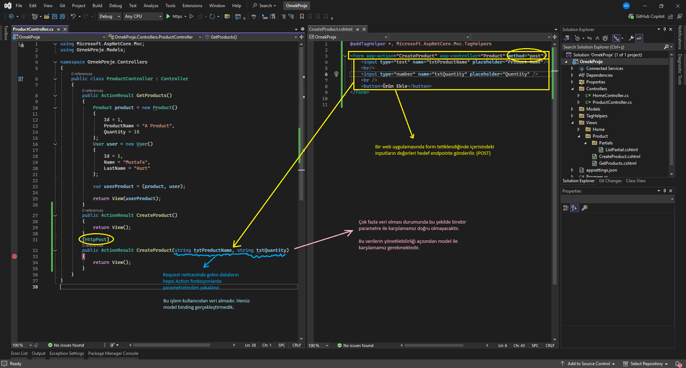

##### Default Binding

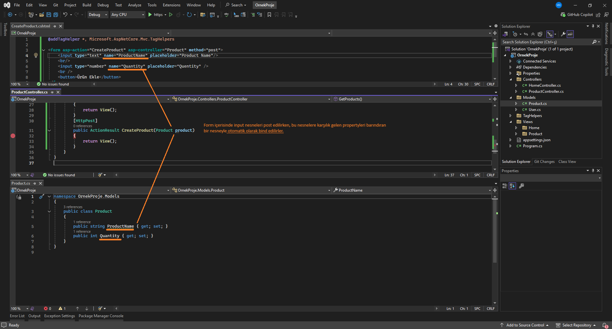

Farklı bir 'name' değeri veya property adı olması durumunda, bind işlemi gerçekleşemiyeceği veya hataya sebep olabileceği için, TagHelpers ve model kullanarak bu süreci daha efektif hale getirebilmekteyiz.

##### TagHelper & Model ile Model Binding

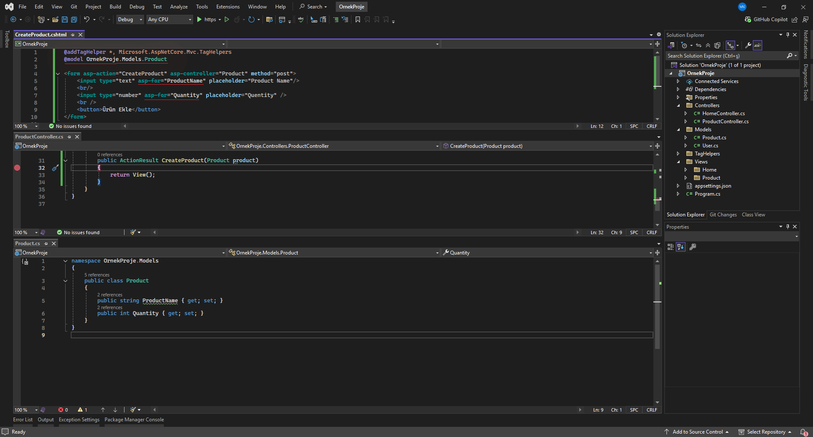

##### HtmlHelper & Model ile Model Binding

HtmlHelper ile ise model üzerinden model binding aşağıdaki şekilde gerçekleştirilmektedir

```html
@addTagHelper *, Microsoft.AspNetCore.Mvc.TagHelpers
@model OrnekProje.Models.Product

<form asp-action="CreateProduct" asp-controller="Product" mothod="post">

    @Html.TextBoxFor(x=>x.ProductName, "" , new { 
    placeholder = "Product Name "})
    
    @Html.TextBoxFor(x=>x.Quantity, "" , new {
    placeholder = "Quantity"
    type="number"})
    
	<button>Ürün Ekle</button>
</form>
@* Buradaki x bizim modelimizi temsil etmektedir. *@
```


## Kullanıcıdan Veri Alma Yöntemleri


### Form üzerinden veri alma

```html
@addTagHelper *, Microsoft.AspNetCore.Mvc.TagHelpers

<form asp-action="VeriAl" asp-controller="Product" method="post">
    <input type="text" name="txtValue1" /><br />
    <input type="text" name="txtValue2" /><br />
    <input type="text" name="txtValue3" /><br />
    <button>Gönder</button>
</form>
```

```csharp
[HttpPost]
//public ActionResult VeriAl(string txtValue1, string txtValue2, string txtValue3) ile otomatik bind edilecek şekilde de alabilmekteyiz.
public ActionResult VeriAl(IFormCollection datas)
{
    var value1 = datas["txtValue1"].ToString();
    var value2 = datas["txtValue2"];
    var value3 = datas["txtValue3"];
    return View();
}
```

**IFormCollection**: `Microsoft.AspNetCore.Http` namespace'i altında kullandığımız gelen bir arayüzdür. Bu arayüz sayesinde post edilen formun içerisindeki tüm input nesnelerinin dataları yakalanabilmektedir.


Eğer ki binding edilmiş dataları kullanıcıdan yakalayacaksak, burada yapmamız gereken işlem view'in model'ini belirlemek.

```html
@addTagHelper *, Microsoft.AspNetCore.Mvc.TagHelpers
@model OrnekProje.Models.Product

<form asp-action="VeriAl" asp-controller="Product" method="post">
    <input asp-for="ProductName" type="text"/><br />
    <input asp-for="Quantity" type="text"/><br />
    <button>Gönder</button>
</form>
```

```csharp
[HttpPost]
public ActionResult VeriAl(Product model)
{
    return View();
}
```


### QueryString Üzerinden Veri Alma

**Query String**: Güvenlik gerektirmeyen bilgilerin url üzerinde taşınması için kullanılan yapılanmadır.

örn. `https://localhost:7183/sehir/ankara?ilce=2`

- Yapılan request'in türü her ne olursa olsun, query string değerleri taşınabilir.

```csharp
//public ActionResult VeriAl(string a, string b)
public ActionResult VeriAl()
{
    var queryString = Request.QueryString;//Request yapılan endpoint'e query string parametresi eklenmiş mi bununla ilgili bilgi verir.
    var a = Request.Query["a"].ToString();
    var b = Request.Query["b"].ToString();
    return View();
}
```

Bu kullanımlar dışında yine instance belirterek de QueryString kullanabilmekteyiz.

```csharp
public class QueryData
{
	public int Plaka {get; set;}
	public string Sehir {get; set;}
}

public ActionResult VeriAl(QueryData data)
{
	var value1 = data.Plaka;
	var value2 = data.Sehir;
	return View();
}
```

`https://localhost:7183/Product/VeriAl?plaka=34&sehir=istanbul`


### Route Paramater Üzerinden Veri Alma

Bu konu için Route yapılanmasını hatırlamamız gerekir. Asp.Net Core 5.0 ve öncesi `Startup.cs` içerisinde

```csharp
app.UseEndpoints(endpoints =>
{
    //endpoints.MapControllerRoute("Default", "{controller=Home}/{action=Index}/{id?}");
	endpoints.MapDefaultControllerRoute();
});
```

Asp.Net Core 5.0 sonrası `Program.cs` içerisinde

```csharp
app.MapDefaultControllerRoute();
```

bulunmaktaydı. 

Burada default kullandığımız için id üzerinden parametre ile veri almayı inceleyeceğiz. Daha sonrasında özel rotalar oluşturup, oluşturduğumuz bu rotalar üzerinden verileri taşıyıp bunların nasıl yakalandığını inceleyeceğiz.

```csharp
public ActionResult VeriAl(string id)
{
    var values = Request.RouteValues; //values ise `controller`,`action`,`id` parametrelerini bizlere getirecektir.
    return View();
}
```

url: `https://localhost:7183/Product/VeriAl/5` girdiğimizde string id parametresi 5 değerini alacaktır.


Default dışında, özel yapılandırdığımız bir rota eşliğinde bu veri alma işlemleri nasıl gerçekleşir onu inceleyerek devam edelim;
```csharp
app.MapControllerRoute("CustomRoute","{controller=Home}/{action=Index}/{a}/{b}/{id?}");
```

```csharp
public ActionResult VeriAl(string id, string a, string b)
{
    var values = Request.RouteValues;
    return View();
}
```

url: `https://localhost:7183/Product/VeriAl/Ahmet/Mehmet/123124`


Ayrıca bunları bir tür ait instance üzerinden de yakalayabilmekteyiz.

```csharp
public class RouteData
{
    public string A {get; set;}
    public string B {get; set;}
    public string Id {get; set;}
}
public ActionResult VeriAl(RouteData datas)
{
    var values = Request.RouteValues;
    return View();
}
```


#### Query String ile Route Parameter Arasındaki Fark

Query String:
`https://localhost:7183/Product/VeriAl?name=Ahmet&password=123`

Route Parameter:
`https://localhost:7183/Product/VeriAl/Ahmet/123`

1. Route yapılanmaları daha gizli bir şekilde veriyi taşımanızı sağlarken, query string alenen açık, güvensiz bir şekilde taşımanızı sağlıyor.


#### TagHelpers ile a Tagı üzerinden Route Yapısını İnceleyelim

```csharp
app.MapControllerRoute("CustomRoute","{controller=Home}/{action=Index}/{a}/{b}/{id?}");
app.MapDefaultControllerRoute();
```

Route yapısında hem default hemde customize ettiğimiz rotayı, yani her ikisinide aktif ederek aşağıdaki şekilde inceleyelim.

```html
@addTagHelper *, Microsoft.AspNetCore.Mvc.TagHelpers

@model OrnekProje.Models.Product

<form asp-action="VeriAl" asp-controller="Product" method="post">
...
</form>

<a asp-action="Index" asp-controller="Home" asp-route-a="ahmet" asp-route-b="mehmet" asp-route-id="123" asp-route-x="asdfgwqe">
content</a>
```

asp-route- dedikten sonra route adını belirtiyoruz: `asp-route-a` veya `asp-route-b` gibi..

Route'larımız arasında x olmadığı için bunu Query String olarak oluşturacaktır.

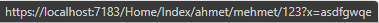


### Header Üzerinden Veri Alma

Kullanıcının göndermiş olduğu request'te yani bu http isteğinde bulunan veridir.

Örneklendirme yapabilmemiz için tarayıcı üzerinden bunu gerçekleştiremeyeceğiz, tarayıcı header'lara manuel olarak müdahale etmemize müsaade etmemektedir.

İleride API yapılanmasında kullanacağımız, Postman ile devam edeceğiz.

```csharp
public ActionResult VeriAl()
{
    var values = Request.Headers.ToList();
    return View();
}
```

Uygulama ayağa kaltığında dahili olan sunucumuzdaki (kestrel) temel route dizinini veriyor, burada 2 port ile başlayacak bunlardan birini alalım.

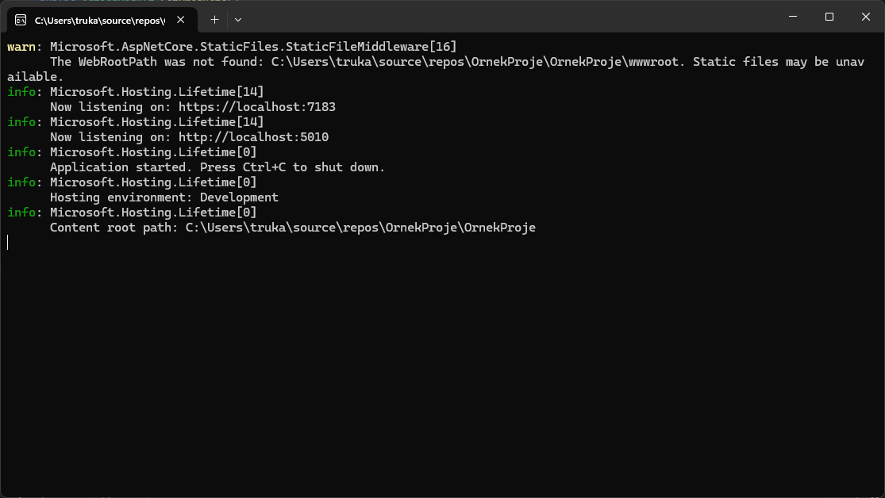

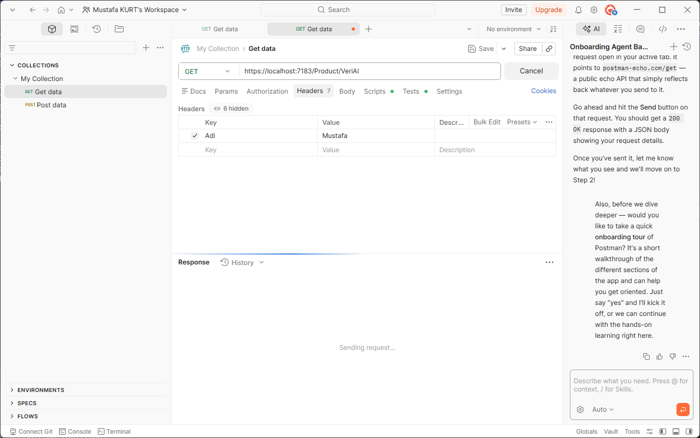

Visual Studio'da ilgili action'un (verial) bitimine breakpoint bırakarak inceleyelim.

Postman'da header için Key ve Value değerleri girerek Get isteğinde bulunalım.

> Header'larda Türkçe karakter kullanılmaz, sadece latince karakterlerle bildirim yapmak zorundasınız. Aksi halde **400 Bad Request** hatası almaktayız.


### Ajax Tabanlı Veri Alma

Ajax, client tabanlı istek yapmamızı sağlayan ve bu isteklerin sonucunu almamızı sağlayan javascript temelli bir mimaridir.

JQuery ve Ajax mimarisi kullanılacak olsak da, kullanıcının veri göndermesine yönelik bir incelemede bulunacağız.

```csharp
public class AjaxData{
    string A {get; set;}
    string B {get; set;}
}
[HttpPost]
public ActionResult VeriAl(AjaxData ajaxData)
{
    return View();
}
```

```html
@addTagHelper *, Microsoft.AspNetCore.Mvc.TagHelpers

<script src="https://code.jquery.com/jquery-3.5.1.min.js"></script>

<button id="btnGonder">Gönder</button>

<script>
	$("#btnGonder").click(() => {
		$.post("https://localhost:7183/product/verial",{a: "a data", b: "b data"});
	});
</script>
```


### Tuple Nesne Post Etme ve Yakalama

```csharp
public ActionResult CreateProduct()
{
    var tuple = (Product: new Product(), User: new User()); //Eğer ki bind mekanizmasında tuple türde bir nesne kullanıyorsak, bu tuple nesnenin içerisinde datalar/değerler/nesneler/object oluşturulup verilmesi gerekmektedir.
    return View(tuple);
}
[HttpPost]
public ActionResult CreateProduct([Bind(Prefix ="Item1")] Product product, [Bind(Prefix ="Item2")] User user)
{
    return View();
}
```

```html
@addTagHelper *, Microsoft.AspNetCore.Mvc.TagHelpers

@model (OrnekProje.Models.Product product,OrnekProje.Models.User user)

<form asp-action="CreateProduct" asp-controller="Product" method="post">

    <input type="text" asp-for="product.ProductName" placeholder="Product Name" /><br />
    <input type="number" asp-for="product.Quantity" /><br />

    <input type="text" asp-for="user.Name" placeholder="Firstname" /><br />
    <input type="text" asp-for="user.LastName" placeholder="Lastname" /><br />

    <button>Gönder</button>
</form>
```


## Validation (Veri Doğrulama)

Validation, bir değerin içinde bulunduğu şartlara uygun olması durumudur.
Belirlenen koşullara ve amaca uygun olup olmama durumunun kontrol edilmesidir. Bu kontrole göre verinin işleme tabii tutulması durumudur.

Yapılan validation client ve server tarafında gerçekleştirilebilmektedir. Paralel bir şekilde client ve server taraflarında uygulanmalıdır.
Validation koşul yapıları ile sağlanabilmektedir lakin bu doğru bir yöntem olmayacaktır. 


### Kullanıcıdan Gelen Verilerin Doğrulanması

Bu noktada "Data Annotations" attribute'larından yararlanacağız.

Model, ViewModel, Entity yani veriyi karşılıyacak olan model yapılanmasında;
```csharp
using System.ComponentModel.DataAnnotations;

public class Product
{
    [Required(ErrorMessage = "Lütfen product name'i giriniz.")]
    [StringLength(100,ErrorMessage = "Product name 100 karakterden uzun olamaz!")]
    public string ProductName {get; set;}
    
    public int Quantity {get; set;}
    
    [EmarilAdress(ErrorMessage = "Lütfen doğru bir email adresi giriniz.")]
    public string Email {get; set;}
}
```

```csharp
public class ProductController : Controller
{
    public ActionResult CreateProduct()
    {
        return View();
    }
    
    [HttpPost]
    public ActionResult CreateProduct(Product model)
    {
    //ModelState: Mvc'de bir type'ın data annotationslarının durumunu kontrol eden ve geriye sonuç dönen bir property.
        if (!ModelState.IsValid)
        {
            //Model geçerli değilse yapılacak işlemler
            //Veritabanına kaydetme, kullanıcıya geri bildirim verme vb.
            
            //Eğer ki server side hata alırsak ve bunu viewde gösterebilmek için viewbag ile elde edebiliriz;
			ViewBag.HataMesaj = ModelState.Values.FirstOrDefault(x => x.ValidationState == Microsoft.AspNetCore.Mvc.ModelBinding.ModelValidationState.Invalid).Errors[0].ErrorMessage;
            
            return View(model);
        }
        //İşleme/Operasyona/Algoritmaya tabi tutulur.
        return View();
    }
}
```


ViewBag ile özel yakalayıp göstermek yerine bunu view tarafında `<span asp-validation-for=""> `ile de gerçekleştirebilmekteyiz. (Server side için)

```html
@addTagHelper *, Microsoft.AspNetCore.Mvc.TagHelpers

@model OrnekProje.Models.Product

<form asp-action="CreateProduct" asp-controller="Product" method="post">

    <input type="text" asp-for="ProductName" placeholder="Product Name" />
	<span asp-validation-for="ProductName"></span><br />
    
    <input type="number" asp-for="Quantity" placeholder="Quantity" />
    <span asp-validation-for="Quantity"></span><br />
    
    <input type="email" asp-for="Email" placeholder="Email" />
    <span asp-validation-for="Email"></span><br />
    
    <button>Gönder</button>

</form>
```

`<div asp-validation-summary="All"></div>` kullanarak da sayfa bazlı tüm hataları listeleyebilirsiniz.


#### Kısa bir Kritik

Entity modellarımızda kullandığımız validasyonlar (data annotations attributeları), solid prensiplerinde single responsibility / tek sorumluluk ilkesine aykırıdır. ViewModel'larımızda kullanırsak da yine aynı şekilde aykırı olabilmektedir. Böyle bir durumda iki yöntemle validation tanımlamalarını farklı sınıflara üstlendirebilmekteyiz. 

1) ModelMetadataType
2) FluentValidation veya başka bir validasyon kütüphaneleri..


### ModelMetadataType ile Validation Sorumluluğunu Başka Bir Sınıfa Yükleme

Models klasörü içerisine ModelMetadataTypes adında bir klasör oluşturuyoruz ve altına validation uygulayacağımız sınıfı oluşturuyoruz.

`ProductMetadata.cs`

```csharp
using System.ComponentModel.DataAnnotations;

namespace OrnekProje.Models.ModelMetadataTypes
{
    public class ProductMetadata
    {
        [Required(ErrorMessage = "Product name is required.")]
        [StringLength(100, ErrorMessage = "Product name cannot exceed 100 characters.")]
        public string ProductName { get; set; }

        [EmailAddress(ErrorMessage = "Invalid mail adress!")]
        public string Email { get; set; }
    }
}

```

Ardından bu modeldata'yı uygulayacağımız entity'de `[ModelMetadataType(typeof(xModeldata))]` attribute'u ile belirtiyoruz:
```csharp

using Microsoft.AspNetCore.Mvc;
using OrnekProje.Models.ModelMetadataTypes;

namespace OrnekProje.Models
{
    [ModelMetadataType(typeof(ProductMetadata))]
    public class Product
    {
        public string ProductName { get; set; }
        public int Quantity { get; set; }
        public string Email { get; set; }
    }
}

```

Bundan sonra sistem her ne kadar `Product` üzerinden veriyi taşısa da, bu product'la ilgili validasyonları, karşılığı olan `ProductMetada`'da doğrulayacaktır.

 

### FluentValidation Kütüphanesi ile Validation İşlemleri

> Manage Nuget Package: FluentValidation.AspNetCore kütüphanesini dahil ediyoruz.

Program.cs içerisinde `builder.Services.AddControllersWithViews()` devamında:
```csharp
builder.Services.AddControllersWithViews().AddFluentValidation(x => x.RegisterValidatorsFromAssemblyContaining<Program>());
```

Bu sayede validator'lerimizi tek tek eklemek yerine, otomatik eşleşen bir yapıda mimariye bildirmiş oluyoruz.

> Models klasörü içerisine, Validators adında bir alt klasör ve onun altında Validator sınıfımızı oluşturuyoruz.

Oluşturduğumuz bu sınıfın `AbstractValidator<EntityViewModel>`' den kalıtım alması gerekmektedir.
Ardından ctor oluşturup içerisine `RuleFor()` metodunu çağırıyoruz. Devamında ise uygulanacak validasyonu seçip `WithMessage()` ile validasyon mesajını giriyoruz.

```csharp
public class ProductValidator : AbstractValidator<Product>
{
    public ProductValidator()
    {
        RuleFor(p => p.ProductName).NotNull().WithMessage("Product name is required.").NotEmpty().WithMessage("");
        RuleFor(p => p.ProductName).MaximumLength(100).WithMessage("Product name cannot exceed 100 characters.");
        RuleFor(p => p.Quantity).GreaterThan(0).WithMessage("Quantity must be greater than zero.");
        RuleFor(p => p.Email).EmailAddress().WithMessage("Invalid email format.");
        RuleFor(p => p.Email).NotNull().WithMessage("Email is required.");
    }
}
```

Program.cs içerisinde yapmış olduğumuz otomatik eşleşme neticesinde bu ilgili validator sınıfı eşleşerek bizlere server-side validasyon sağlamaktadır.


#### Server'da ki Validation'ları Dinamik Olarak Client Tabanlı Uygulamak

Client-side ve server-side validasyon kurallarını ayrı ayrı yazmak yerine jquery kütüphaneleri yardımıyla bunları tek bir noktadan yönetilebilir hale getireceğiz.

Bunun için projeye sağ tıklayıp Add > Client-side libraries'i seçtikten sonra, hedef lokasyon wwwroot klasörüne tanımlamamız gerekmekte, ilk olarak jquery kütüphanesini dahil edeceğiz.

wwwroot seçip sağ tıklayıp ilgili diğer kütüphaneleri de yükleyelim: `jquery-validate` ve `jquery-validation-unobtrusive`

Ardından view içerisinde başlangıca ilgili kütüphaneleri dahil edelim:
```html
@addTagHelper *, Microsoft.AspNetCore.Mvc.TagHelpers
@model OrnekProje.Models.Product

<script src="~/jquery/jquery.min.js"></script>
<script src="~/jquery-validate/jquery.validate.min.js"></script>
<script src="~/jquery-validate-unobtrusive/jquery.validate.unobtrusive.min.js"></script>

<form asp-action="CreateProduct" asp-controller="Product" method="post">
    <div asp-validation-summary="All"></div>
    <input type="text" asp-for="ProductName" placeholder="Product Name" /><br />
    <input type="number" asp-for="Quantity" placeholder="Quantity" /><br />
    <input type="email" asp-for="Email" placeholder="Email" /><br />
    <button>Gönder</button>

</form>
```

Böylelikle istek neticesinde server tarafına gidecek olan validasyonlar, client tarafında kalacak ve server'a doğrudan gitmeyecektir.


## Layout Yapılanması


Her view içerisinde navbar, sidebar, footer gibi yapıları tekrar tekrar yazmamız, 
kod ve kirliliği yanı sıra, client tarafında bir maliyete sebep olacaktır.
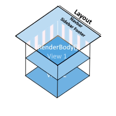
Dolayısıyla bizler bunları bir kere Layout'ta tanımlar ve ilgili içerikleri (view'leri) RenderBody() ile Layout içerisine çekeriz.


#### Layout nedir?

Web sayfalarının olmazsa olmazıdır.
Sayfadan sayfaya gezinirken kullanıcıya tutarlı bir deneyim sağlayan ortak sayfa taslağıdır.
Tutarlı bir düzene sahip bir web sitesi oluşturmak için kullanılır.


#### RenderBody ve RenderSection Fonksiyonları Nelerdir?

##### RenderBody

Render edilen view'lerin layout'ta içeriğin nereye basılacağını temsil eder. Layout'ta tanımlanması zorunludur.
Sadece bir kere tanımlanmak zorundadır.


##### RenderSection, 

- Layout içerisinde isimsel bölümler oluşturmamızı sağlar. İhtiyaç doğrultusunda bu bölümlere render edilen view'lerden de içerikler atanabilir.
  `@RenderSection("solmenu",false)` -required durumu, bool olarak default değer true'dur, bu da section'un kullanılmadığı view'lerde hataya sebep olacaktır.
  View'de kullanırken: `@section solmenu{ }
- Genellikle, JS referansları, sayfadan sayfaya fark eden alanlarda kullanılır.


#### Layout Kullanımı

Views klasörü içerisinde Shared klasöründe yer alır. İsimlendirirken `_` ile başlar.

`_Layout.cshtml`

```html

<!DOCTYPE html>

<html>
<head>
    <meta name="viewport" content="width=device-width" />
    <title>@ViewData["Title"]</title>
    <link href="https://cdn.jsdelivr.net/npm/bootstrap@5.3.3/dist/css/bootstrap.min.css" rel="stylesheet">
	<script src="https://cdn.jsdelivr.net/npm/bootstrap@5.3.3/dist/js/bootstrap.bundle.min.js"></script>

    @RenderSection("script", required: false)

</head>
<body>
    <nav class="navbar navbar-expand-lg navbar-light bg-light">
        <a class="navbar-brand" href="#">Navbar</a>
        <button class="navbar-toggler" type="button" data-toggle="collapse" data-target="#navbarNavAltMarkup" aria-controls="navbarNavAltMarkup" aria-expanded="false" aria-label="Toggle navigation">
            <span class="navbar-toggler-icon"></span>
        </button>
        <div class="collapse navbar-collapse" id="navbarNavAltMarkup">
            <div class="navbar-nav">
                <a class="nav-item nav-link active" href="#">Home <span class="sr-only">(current)</span></a>
                <a class="nav-item nav-link" href="/Product/GetProducts">Products</a>
                <a class="nav-item nav-link" href="/Product/CreateProduct">Create Product</a>
            </div>
        </div>
    </nav>
    @RenderBody()
</body>
</html>
```


`getproducts.cshtml`

```html
@addTagHelper *, Microsoft.AspNetCore.Mvc.TagHelpers
@addTagHelper *, OrnekProje

@{
    Layout = "~/Views/Shared/_Layout.cshtml";
    ViewData["Title"] = "Get Products";
}

@* <email mail="trukafatsum@@gmail.com" display="Mustafa Kurt Mail"></email> *@
<mail mail="test@@gmail.com" display="test">testt</mail>
```


`createproduct.cshtml`

```html 
@model OrnekProje.Models.Product
@addTagHelper *, Microsoft.AspNetCore.Mvc.TagHelpers

@section script {
<script src="~/jquery/jquery.min.js"></script>
<script src="~/jquery-validate/jquery.validate.min.js"></script>
<script src="~/jquery-validate-unobtrusive/jquery.validate.unobtrusive.min.js"></script>
}

@{
    Layout = "~/Views/Shared/_Layout.cshtml";
    ViewData["Title"] = "Create Product";
}


<form asp-action="CreateProduct" asp-controller="Product" method="post">
    <div asp-validation-summary="All"></div>
    <input type="text" asp-for="ProductName" placeholder="Product Name" /><br />
    <input type="number" asp-for="Quantity" placeholder="Quantity" /><br />
    <input type="email" asp-for="Email" placeholder="Email" /><br />
    <button>Gönder</button>

</form>
```


#### _ViewStart ve ViewImports Dosyaları Nelerdir?


#### _ViewStart Nedir?

Asıl amacı tüm view'lerde kullanılması/yapılması gereken ortak çalışmaların yapıldığı view'dir.

- Bir nevi tüm view'lerin atasıdır diyebiliriz.

- Views klasörü altında `_ViewStart.cshtml` olarak oluşturulması gerekir.

Genellikle tüm view'lerin ortak kullanacağı Layout tanımlaması bu dosya içerisinde gerçekleştirilir.

Kullanımda render edilecek olan her view içerisinde ayrı ayrı `Layout` çağırmak yerine Views içerisinde bulunan, `_ViewStart.cshtml`'de bu tanımı gerçekleştirmek daha uygun olacaktır.

Eğer ki bir view içerisinde farklı bir layout kullanmak istersek, yine ilgili view'de layout tanımlamalıyız. Veyahut hiç layout ve viewstart kullanmak istemiyorsakta, yine ilgili view içerisinde `Layout = null` olarak belirtmemiz yeterli olacaktır.


#### _ViewImports Nedir?

Razor sayfaları için kütüphane ve namespace tanımlamalarını sayfa sayfa farklı tanımlamaktansa ortak/merkezi olarak tanımlamamızı sağlayan bir dosyadır.

- Views klasörü altında `_ViewImports.cshtml` isminde oluşturulmalıdır.

Örnek kullanım:

`_ViewImports.cshtml`

```cshtml
@using OrnekProje.Models
@addTagHelper *, Microsoft.AspNetCore.Mvc.TagHelpers
```

`CreateProduct.cshtml`

```html
@model Product //Burada namespace tanımlıyorduk, artık bu tanımı _ViewImports ile gerçekleştirdik

@section script {
<script src="~/jquery/jquery.min.js"></script>
<script src="~/jquery-validate/jquery.validate.min.js"></script>
<script src="~/jquery-validate-unobtrusive/jquery.validate.unobtrusive.min.js"></script>
}


<form asp-action="CreateProduct" asp-controller="Product" method="post">
    <div asp-validation-summary="All"></div>
    <input type="text" asp-for="ProductName" placeholder="Product Name" /><br />
    <input type="number" asp-for="Quantity" placeholder="Quantity" /><br />
    <input type="email" asp-for="Email" placeholder="Email" /><br />
    <button>Gönder</button>

</form>
```


## Modüler Tasarım Yapılanması

#### Modüler Tasarım Nedir?

Tek bir sorumluluğu üstlenecek parçaların bir araya gelerek bütünü oluşturması.

Bunun için birçok örnek verilebilir;
a) Otomobilin tekerinin patlamasının, vitesi veya başka herhangi bir parçayı etkilememesi,
b) Mahallelere özel trafolar takılarak, ilçede yaşanacak elektrik kesintilerinin sadece o mahallede gerçekleşmesi,
c) Dişimiz ağrıdığında bunun başka bir organımızı etkilememesi gibi gibi..

Haliyle bizler kullandığımız teknolojilerde de modüler tasarımı ön planda tutmamız gerekir.
Bunu Asp Net Core Mvc de uygulamak istediğimizde karşımıza `PartialView` ve `ViewComponent` çıkmaktadır.


### PartialView

Modüler tasarım yapılanmasında, her bir modülün ayrı bir .cshtml olarak tasarlanmasını ve ihtiyaç doğrultusunda ilgili parçanın çağırılıp kullanılmasını sağlayan bir yöntemdir.

Home klasörü içerisine Partials klasörü oluşturup bunun içine;
`_HeaderPartial.cshtml`

```html
<header>
    <nav class="navbar navbar-expand-sm navbar-toggleable-sm navbar-light bg-white border-bottom box-shadow mb-3">
        <div class="container">
            <a class="navbar-brand" href="#">OrnekProje</a>
            <button class="navbar-toggler" type="button" data-toggle="collapse" data-target=".navbar-collapse" aria-controls="navbarSupportedContent" aria-expanded="false" aria-label="Toggle navigation">
                <span class="navbar-toggler-icon"></span>
            </button>
            <div class="navbar-collapse collapse d-sm-inline-flex justify-content-between">
                <ul class="navbar-nav flex-grow-1">
                    <li class="nav-item">
                        <a class="nav-link text-dark" asp-area="" asp-controller="Home" href="#">Home</a>
                    </li>
                    <li class="nav-item">
                        <a class="nav-link text-dark" asp-area="" asp-controller="Product" asp-action="GetProducts">Products</a>
                    </li>
                    <li class="nav-item">
                        <a class="nav-link text-dark" asp-area="" asp-controller="Product" asp-action="CreateProduct">Create Product</a>
                    </li>
                </ul>
            </div>
        </div>
    </nav>
</header>
```

Oluşturuyoruz.

Layout'ta ise bunu 3 farklı şekilde çağırabilmekteyiz: `HtmlHelper (partial veya renderpartial metotları), TagHelper`

```html

<!DOCTYPE html>

<html>
<head>
    <meta name="viewport" content="width=device-width" />
    <link href="https://cdn.jsdelivr.net/npm/bootstrap@5.3.3/dist/css/bootstrap.min.css" rel="stylesheet">
	<script src="https://cdn.jsdelivr.net/npm/bootstrap@5.3.3/dist/js/bootstrap.bundle.min.js"></script>
    <title>@ViewData["Title"]</title>
    @RenderSection("script", required: false)

</head>

<body>
    @* @Html.Partial("~/Views/Home/Partials/_HeaderPartial.cshtml")") *@
    @* @{Html.RenderPartial("~/Views/Home/Partials/_HeaderPartial.cshtml");} *@
    <partial name="~/Views/Home/Partials/_HeaderPartial.cshtml" />
    <div class="container">
        <div class="row">
            <div class="col-md-12">
                @*Slide*@
            </div>
        </div>
        <div class="row">
            <div class="col-md-2">
                @*Sidebar*@
            </div>
            <div class="col-md-8">
                <main role="main" class="pb-3">
                    @RenderBody()
                </main>
            </div>
            <div class="col-md-2">
            </div>
        </div>
    </div>

    @*Footer*@
</body>
</html>

```


#### PartialView ile Veri Gönderme Kritiği

Slayta controller üzerinden veri göndermek istersek ve Controller'da view'e farklı bir tür gönderilecekse,
bunu ViewBag veya TempData olarak, 

```csharp
public class ProductController : Controller
{
    public ActionResult GetProducts()
    {
        ViewBag.Data = new List<string>()
        {
            $"https://picsum.photos/seed/{Guid.NewGuid()}/1920/1080",
             $"https://picsum.photos/seed/{Guid.NewGuid()}/1920/1080",
             $"https://picsum.photos/seed/{Guid.NewGuid()}/1920/1080",
        };
        object o = new object();
        return View(o);
    }
}
```

Layout üzerinde modeli bildirmeliyiz.

`Layout`

```html

<!DOCTYPE html>

<html>
<head>
    <meta name="viewport" content="width=device-width" />
    <link href="https://cdn.jsdelivr.net/npm/bootstrap@5.3.3/dist/css/bootstrap.min.css" rel="stylesheet">
    <script src="https://cdn.jsdelivr.net/npm/bootstrap@5.3.3/dist/js/bootstrap.bundle.min.js"></script>
    <title>@ViewData["Title"]</title>
    @RenderSection("script", required: false)

</head>

<body>
    @* @Html.Partial("~/Views/Home/Partials/_HeaderPartial.cshtml")") *@
    @* @{Html.RenderPartial("~/Views/Home/Partials/_HeaderPartial.cshtml");} *@
    <partial name="~/Views/Home/Partials/_HeaderPartial.cshtml" />
    <div class="container">
        <div class="row">
            <div class="col-md-12">
                @*Slide*@
                <partial name="~/Views/Home/Partials/_SliderPartial.cshtml" model="ViewBag.Data"/>
            </div>
        </div>
        <div class="row">
            <div class="col-md-2">
                @*Sidebar*@
            </div>
            <div class="col-md-8">
                <main role="main" class="pb-3">
                    @RenderBody()
                </main>
            </div>
            <div class="col-md-2">
            </div>
        </div>
    </div>

    @*Footer*@
</body>
</html>

```

Buradaki belirlemeye göre, model olarak ilgili datayı yakalayacaktır.

`_SliderPartial.cshtml`

```html
@model List<string>

<div id="carouselExampleIndicators"
     class="carousel slide"
     data-bs-ride="carousel">

    <!-- Indicators -->
    <div class="carousel-indicators">

        @{
            var indicatorIndex = 0;
        }

        @foreach (var item in Model)
        {
            <button type="button"
                    data-bs-target="#carouselExampleIndicators"
                    data-bs-slide-to="@indicatorIndex"
                    class="@(indicatorIndex == 0 ? "active" : "")"
                    aria-current="@(indicatorIndex == 0 ? "true" : "false")"
                    aria-label="Slide @(indicatorIndex + 1)">
            </button>

            indicatorIndex++;
        }

    </div>

    <!-- Slides -->
    <div class="carousel-inner">

        @{
            var first = true;
            var slideIndex = 0;
        }

        @foreach (var data in Model)
        {
            <div class="carousel-item @(first ? "active" : "")">

                

            </div>

            first = false;
            slideIndex++;
        }

    </div>

    <!-- Previous Button -->
    <button class="carousel-control-prev"
            type="button"
            data-bs-target="#carouselExampleIndicators"
            data-bs-slide="prev">

        <span class="carousel-control-prev-icon" aria-hidden="true"></span>
        <span class="visually-hidden">Previous</span>

    </button>

    <!-- Next Button -->
    <button class="carousel-control-next"
            type="button"
            data-bs-target="#carouselExampleIndicators"
            data-bs-slide="next">

        <span class="carousel-control-next-icon" aria-hidden="true"></span>
        <span class="visually-hidden">Next</span>

    </button>

</div>
```

> Dikkat!
> PartialView'in modeli List<string> ancak layout'a gelen asıl model 'Object' bu başka bir türde olabilir.
> View'e dönen <T> model var iken biz başka bir model daha belirtmek istediğimizde bunu taghelper kullanarak ilgili yerde <model=""/> tagını kullanabilmekteyiz.


#### PartialView'lerde RenderSection Kritiği

RenderSection kullanıldığı durumlarda PartialView'lerden RenderSection'a biz bir değer gönderememekteyiz.


### ViewComponent


> Özetle:
> PartialView yapılanması ihtiyacı olan dataları Controller üzerinden elde edeceği için Controller'daki maliyeti arttırmakta ve SOLID prensiplerine aykırı davranılmasına sebebiyet verebilmektedir.
> PartialView, yapısal olarak controller üzerinden beslenmektedir.
>
> ViewComponent, ihtiyacı olan dataları controller üzerinden değil, direkt kendi .cs dosyasından elde edebilmektedir. Böylece controllerdaki lüzumsuz maliyeti ortadan kaldırmış olmaktayız.


#### ViewComponent Oluşturma

ViewComponent iki yapıdan oluşmaktadır, bunlardan biri .cshtml, diğeri ise .cs dosyasıdır.
Projemizde ViewComponents adında bir klasör oluşturduktan sonra isimlendirme kuralına uyarak bir sınıf oluşturalım.

```csharp
using Microsoft.AspNetCore.Mvc;

namespace OrnekProje.ViewComponents
{
    public class BannersViewComponent :ViewComponent
    {
        public IViewComponentResult Invoke() //Tasarlanan viewcomponent çağırılıp render edildiğinde içerisinde çalışmasını istediğimiz kodları bu imzada bir metodun içerisine yerleştirmeliyiz. İsmide geri dönüş türüde bu imzadakiyle aynı olmak zorundadır!
        {
			List<Banner> datas = new List<Banner>()
            {
                new Banner()
                {
                    ImageUrl = $"https://srocave.b-cdn.net/global100.avif",
                    Alt = "Global100 Online",
                    blankUrl = "https://srocave.com/konular/global-sro-90-cap-guncellemesi-only-ch-ivsro-r-macro-progressive-									beta-25-07-g-o-01-08.1322/"
                },
                new Banner()
                {
                    ImageUrl = $"https://srocave.b-cdn.net/victoria140.avif",
                    Alt = "Victoria Online",
                    blankUrl= "https://srocave.com/konular/victoria-rohan-130-cap-isro-r-server-wheel-pet-job-set-system-140-									cap-upgrade-05-06-2026.2811/"
                },
                new Banner()
                {
                    ImageUrl = $"https://srocave.b-cdn.net/azurex.avif",
                    Alt = "Azurex Online",
                    blankUrl = "https://srocave.com/konular/azurex-online-110-cap-eu-ch-coin-system-activity-based-play2win-									beta-18-05-grand-22-05-2026.3393/"
                }
            };
            return View(datas);
        }
    }
}
```

Render edilecek view component'lar, view'i render edebilmek için 2 ayrı yere bakmaktadır. 

Bunlardan ilki **Controller Bazlı**, Views içerisinde ilgili controller'ın altındaki Components klasörü içerisinde ViewComponent'in adını taşıyan klasörün içerisindeki default.cshtml'dir.
`Views/Product/Components/Banners/Default.cshtml`

Eğer ki farklı bir isimde bildirmek istiyorsak, `return View("Banner");`içerisindeki parametrede bildirmemiz gerekmektedir.

Bir diğer yöntemle **Uygulama Bazlı** ise, Shared'ın altında Components klasörü ve onun içerisine yine ViewComponent'in adındaki klasörün içerisinde Default.cshtml oluşturmamız gerekmektedir.

`Views/Shared/Components/Banners/Default.cshtml`

Ön tanımlı kullanımlar bu şekildedir. Özel olarak `return View();`içerisinde path bildirilerekte kullanılabilmektedir.

`Model: Banner`

```csharp
namespace OrnekProje.Models
{
    public class Banner
    {
        public string ImageUrl { get; set; }
        public string Alt { get; set; }
        public string blankUrl { get; set; } = "#";
    }
}

```

`Layout'a eklenecek olan: @await Component.InvokeAsync("Banners")`


#### Kritik 1 : ViewComponent Gelen Request'leri Karşılayabilir mi?

ViewComponent'ların .cs dosyaları, Controller gibi çalışamamakta. Sadece get operasyonlarında çalışabilmektedirler.
Haliyle ViewComponent'ta bir form bile tasarlarsak, bunun post neticesini bir controllerda tanımlamamız gerekmektedir.


#### Kritik 2 : ViewComponent'a Render Edilirken Değer Gönderme

ViewComponent'lerin fonksiyonel yani parametrik çalışmalarıdır. Render edilme esnasında viewcomponent'lara farklı değerler gönderebilmekteyiz.

`örnek`

```csharp
public class BannersViewComponent : ViewComponent
{
    public IViewComponentResult Invoke(int id)
    {
        List<Banner> datas = new List<Banner> {
            ...
        }
        return View(datas);
    }
}
```

`Layout'a gönderilen parametre: @await Component.InvokeAsync("Banners",new {id = 5})`


#### Kritik 3 : NonViewComponent Attribute'u

ViewComponent sınıfının farklı amaçlara hizmet edeceği durumlarda, ViewComponent olmadığını bildirebilmek için bu attribute'u kullanabilmekteyiz.
`[NonViewComponent]`

Aynı mantıkta daha önce `[NonController]` ve `[NonAction]`u incelemiştik.


## Route Yapılanması

#### Route Nedir?

Gelecek olan isteğin hangi rotaya gideceğini belirleyen şablonlardır.


#### MapDefaultControllerRoute İle Default Route Ayarlama

Gelen rotayı ayrıştırma işlemini `app.UseRoting()` de gerçekleştirirken, rotaları tanımlama operasyonlarını aşağıdaki yapıda gerçekleştiriyoruz.

```csharp
/* Asp.Net Core 6.0 ve öncesi
app.UseEndpoints (endpoints =>{
    endpoints.MapDefaultControllerRoute();
    //endpoints.MapControllerRoute( name: "default", pattern: "{controller=name}/{action=Index}/{id?}");
});
*/
// ##### Asp Net Core 6.0 sonrası #####
//app.MapControllerRoute( name: "default", pattern: "{controller=name}/{action=Index}/{id?}");
app.MapDefaultControllerRoute();
```

Parametrelerde, `{controller=name}/{action=Index}` görüldüğü üzere parametre ön tanımlıdır. Bunların yanı sıra eklenen tüm rotalar, custom rota olarak geçmektedir.

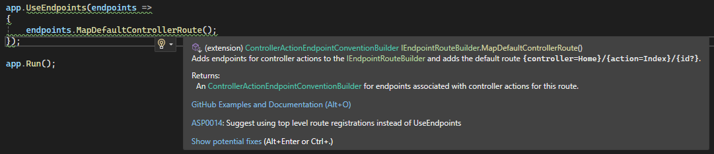

`MapDefaultControllerRoute()` kullanımında, eğer ki controller boş gelirse default olarak Home, action da boş gelirse Index'e yönlendirecektir.

```md
/home -> Home/Index getirecektir.
/home/index -> Yine Home/Index getirecektir.
/personel/getir -> Personel controllerdaki getir action'u varsa tetiklenecektir.
/personel -> Burada ise personel controllerı altında Index'i tetikleyecektir. Çünkü default olarak action=Index tanımı yer almaktadır.
```


#### MapControllerRoute ile Custom Route Oluşturma

```csharp
/* 5.0 öncesi
app.UseEndpoints(endpoints =>{
    endpoints.MapControllerRoute("Custom","{controller=Dashboard}/{action=Verify}/{id?}");
});
*/
app.MapControllerRoute("Custom","{controller=Dashboard}/{action=Verify}/{id?}");
```

Eğer ki biz controller ve action'a default değer (Dashboard, Verify gibi..) vermezsek, boş gelme durumlarında hata verecektir.

Bizim controller veya action yoksa, 404 hatası alacağız, eğer ki her ikiside var view yoksa:
`InvalidOperationException:The view 'Index' was not found...` hatası alacağız.


Anonim olarak statik bir değerde sayfamız açılsın istiyorsak;
```csharp
app.MapControllerRoute("Anonim", "Anasayfa", new {controller = "Home", action = "Index"});
```

Sayfa açılırken `localhost:5001/Anasayfa`  ilgili controllerdaki ilgili action'u tetikleyecektir.

> Dikkat: Eğer ki birden fazla rota oluşturacaksanız, özelden genele olacak şekilde sıralamayla yazmanız gerekir.
> Genelin geçerli olduğu durum en altta olmalıdır.
>
> Ayrıca tanımlanan rotaların isimleri UNIQ olmalıdır. Yukarıdaki gösterimde "Custom" veya "Anonim" gibi yaptığımız isimlendirme.


View tarafında link verirken, oluşturulacak olan link'in adresine en uygun rotayı Program.cs'e veyahut Startup.cs'e gidip rotayı inceleyip ona göre oluşturacaktır.

```cshtml
@Html.ActionLink("Anasayfa","Index","Home")
<br />
<a asp-action="Index" asp-controller="Home">Anasayfa</a>
```

---

```csharp
app.MapControllerRoute("Defaultxyz","{controller=Home}/{action=Index}/{id?}/{x}/{y}/{z}");
```

Id her ne kadar nullable olsada devamında girilen parametreler nullable olmadığı için, id'nin nullable olması çok saçma olacaktır.

Dolayısıyla ya bunların hepsi nullable olmak zorunda yada, sağdan başlayarak nullable vermek zorundayız.


#### Route Constraints

Gelen parametreler her türlü global türde geleceği için, bunları string ile karşılamak gerekmektedir. Türü belirtmesek bile gelecek olan tüm türler string ile ifade edilebilmektedir.
Bu parametrenin türünü bildirmek istersek, `{id:int?}` gibi bildirmemiz gerekmektedir.

##### Value Constraints

| constraint | inline        | Class                   | Notes                                                        |
| ---------- | ------------- | ----------------------- | ------------------------------------------------------------ |
| int        | {id:int}      | IntRouteConstraint      | Constrains a route parameter to represent only 32-bit integer values |
| alpha      | {id:alpha}    | AlphaRouteConstraint    | Constrains a route parameter to contain only lowercase or uppercase letters A through Z in the English alphabet. |
| bool       | {id:bool}     | BoolRouteConstraint     | Constrains a route parameter to represent only Boolean values. |
| datetime   | {id:datetime} | DateTimeRouteConstraint | Constrains a route parameter to represent only DateTime values. |
| decimal    | {id:decimal}  | DecimalRouteConstraint  | Constrains a route parameter to represent only decimal values. |
| float      | {id:float}    | FloatRouteConstraint    | Matches a valid float value (in the invariant culture - see warning) |
| guid       | {id:guid}     | GuidRouteConstraint     | Matches a valid Guid value                                   |


##### Function Constraints

| constraint       | inline             | Class                    | Notes                                                        |
| ---------------- | ------------------ | ------------------------ | ------------------------------------------------------------ |
| length(length)   | {id:length(12)}    | LengthRouteConstraint    | Constrains a route parameter to be a string of a given length or given within a given range of lengths. |
| maxlength(value) | {id:maxlength(8)}  | MaxLengthRouteConstraint | Constrains a route parameter to be a string with a maximum length. |
| minlength(value) | {id:minlength(4)}  | MinLengthRouteConstraint | Constrains a route parameter to be a string with a minimum length. |
| range(min,max)   | {id:range(18,120)} | RangeRouteConstraint     | Constrains a route parameter to be an integer within a given range of values. |
| min(value)       | {id:min(18)}       | MinRouteConstraint       | Constrains a route parameter to be a long with a minimum value. |
| max(value)       | {id:max(20)}       | MaxRouteConstraint       | Constrains a route parameter to be an integer with a maximum value. |


#### Custom Constraint Oluşturma

IRouteConstraint interface'ini kullanacağız, dolayısıyla bunun bir concrete (somut) nesnesine ihtiyacımız olacak dolayısıyla bu somut nesneyi tutabilmek için, proje altına Contrains klasörü oluşturuyoruz.

Bir `CustomConstraint` adında class oluşturuyoruz.

```csharp
public class CustomConstraint : IRouteConstraint
{
    public bool Match(HttpContext? httpContext,
                      IRouter? route, string routeKey,
                      RouteValueDictionary values,
                      RouteDirection routeDirection)
    {
        //throw new NotImplementedException();
        var idvalue = values[routeKey]?.ToString(); //Gelecek olan parametreyi yakalayarak ilgili işlemi return'da gerçekleştirebilmekteyiz.
        
        return true;
    }
}
```

Oluşturduğumuz constraint'i nasıl kullanabileceğimize gelecek olursak;

`Startup.cs` içerisinde:

```csharp
//Asp.Net Core 6.0 ve öncesi
public void ConfigureServices(IServiceCollection services)
{
    services.AddControllersWithViews();
    services.AddRouting(options =>
    {
        options.ConstraintMap.Add("custom", typeof(CustomConstraint));
    });
}
```

`Program.cs` içerisinde

```csharp
//Asp.Net Core 6.0 sonrası
var builder = WebApplication.CreateBuilder(args);

// Add services to the container.
builder.Services.AddControllersWithViews();
builder.Services.AddRouting(options => {     options.ConstraintMap.Add("custom", typeof(CustomConstraint));
});
var app = builder.Build();

// Configure the HTTP request pipeline.
if (!app.Environment.IsDevelopment())
{
    app.UseExceptionHandler("/Home/Error");
    // The default HSTS value is 30 days. You may want to change this for production scenarios, see https://aka.ms/aspnetcore-hsts.
    app.UseHsts();
}

app.UseHttpsRedirection();
app.UseStaticFiles();

app.UseRouting();

app.UseAuthorization();

app.MapControllerRoute("custom", "{controller=Home}/{action=Index}/{id:custom}");

app.Run();


```


#### Attribute Routing

Şimdiye kadar ki gerçekleştirdiğimiz `startup.cs`, `program.cs` route tanımlamaları conventional (geleneksel) olarak geçmektedir. 
Birde controller bazlı attribute tanımlamasıyla rota belirleme yaklaşımı yer almaktadır.

Burada herhangi bir controller kendisine ait, tetiklenecek olan rotayı kendi üzerinde belirleyebilmektedir.

Attribute routing kullanırken action ve controller belirteceğimizde köşeli parantezlerle tanımlama yapmaktayız. `[Route("[controller]/[action]/{id?}")]`

```csharp
[Route("[controller]/[action]")]
public class HomeController : Controller
{
    //..
}
```

```csharp
[Route("Ana")]
public class HomeController : Controller
{
    [Route("in")]
    public IActionResult Index()
    {
        return View();
    }
}
```

```csharp
[Route("[controller]")]
public class HomeController : Controller
{
    [Route("[action]/{id:int?}")]
    public IActionResult Index(int? id)
    {
        return View();
    }
}
```

Elbette bu controllerda yapılacak olan rota tanımlarının eşleşmesi için,
`Startup.cs'te`

```csharp
app.UseEndpoints(endpoints =>{
    endpoints.MapControllers();
});
```

`Program.cs'te`

```csharp
app.MapControllers();
```

tanımı gerekmektedir.


> Temel MVC mimarisinde Conventional yaklaşım sergilerken API'larda attribute üzerinden routing yapılanması gerçekleştiriyor olacağız.


#### Custom Route Handler

Custom Route Handler: Herhangi bir belirlenmiş route şemasının controller sınıflarından ziyade, bisness mantığında karşılanması ve orada iş görüp response'un döndürülmesi operasyonudur.


##### Custom Route Handler Nasıl Oluşturulur?

`Program.cs`

```csharp
app.Map("example-route", async c =>
{
    //https://localhost:5001/example-route endpoint'e gelen herhangi bir istek Controller'dan ziyade direkt olarak buradaki fonksiyon tarafından karşılanacaktır.
});
```

İlgili bir sınıftan fonksiyonu çağıracak olursak, Handlers klasörü ve içerisinde ExampleHandler adında bir sınıf oluşturuyoruz.

```csharp
public class ExampleHandler
{
    public RequestDelegate Handler()
    {
        return async context =>
        {
            await context.Response.WriteAsync("Hello from ExampleHandler!");
        };
    }
}
```

```csharp
app.Map("example-route", new ExampleHandler().Handler());
```


##### Custom Route ile Resim Boyutlandırma

Her ne kadar view tarafında scriptler ile veyahut html düzeyinde resim boyutlandırabilsekte, dosyanın render sürecindeki kapladığı alana etki etmemektedir. Dosya boyutu olarak response'da daha az maliyetli olmasını istediğimiz bir senaryoyu ele alarak handler oluşturacağız.

`Startup.cs`

```csharp
app.UseEndpoints(endpoints=>
{
	endpoints.Map("image/{imageName}", new ImageHandler().Handler(env.WebRootPath));
});
```


`Program.cs`

```csharp
var app = builder.Build();

string webRootPath = app.Enviroment.WebRootPath;

app.Map("image/{imageName}", new ImageHandler().Handler(webRootPath)); //Buradaki webRootPath bizim wwwroot dizinini alır
```


`ImageHandler.cs`

```csharp
public class ImageHandler
{
    public RequestDelegate Handler(string filePath)
    {
        return async c =>
        {
            FileInfo fileInfo = new FileInfo($"{filePath}\\{c.Request.RouteValues["imageName"].ToString()}");
            using MagickImage magick = new MagickImage(fileInfo);

            uint width = magick.Width, height = magick.Height;

            if (!string.IsNullOrEmpty(c.Request.Query["w"].ToString()))
                width = uint.Parse(c.Request.Query["w"].ToString());
            if (!string.IsNullOrEmpty(c.Request.Query["h"].ToString()))
                height = uint.Parse(c.Request.Query["h"].ToString());

            magick.Resize(width, height);

            var buffer = magick.ToByteArray();
            c.Response.Clear();
            c.Response.ContentType = string.Concat("image/", fileInfo.Extension.Replace(".", ""));

            await c.Response.Body.WriteAsync(buffer, 0, buffer.Length);
            await c.Response.WriteAsync(filePath);
        };
    }
}
```

`MagickImage` için kütüphane dahil edilmesi gerekir.


## Middleware Yapılanması

### Middleware Nedir?

- Web uygulamasına client'tan gelen request'e karşılık verilecek response'a kadar arada farklı işlemler gerçekleştirmek ve sürecin gidişatına farklı yön vermek isteyebiliriz.


### Middleware Nasıl Çalışır?

Middleware'ler sarmal bir şekilde tetiklenir. Recursive mantıkta düşünebiliriz.

> Bir middleware başladığında bitmeden diğerine girecektir.

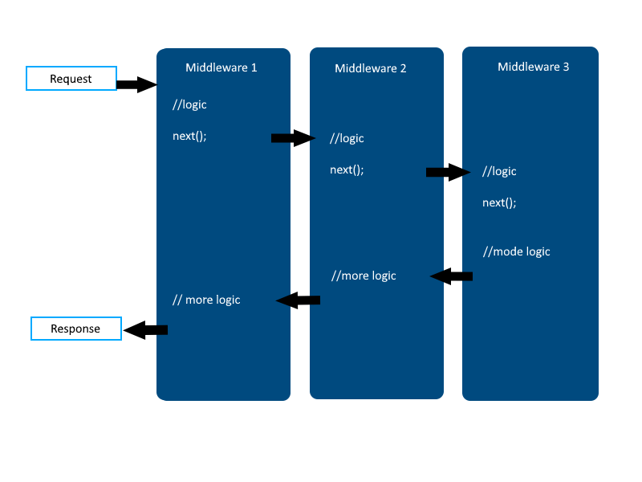

`Asp.Net Core, yapısal olarak middleware yapılanmasını destekleyen bir çekirdeğe sahiptir.`

`Startup.cs`

```csharp
public void Configure(IApplicationBuilder app, IWebHostEnvironment env)
{
    if (env.IsDevelopment())
    {
        app.UseDeveloperExceptionPage();
        app.UseSwagger();
        app.UseSwaggerUI(c => c.SwaggerEndpoint("/swagger/v1/swagger.json", "MiddlewareExample v1"));
    }
    app.UseHttpsRedirection();
    
    app.UseRouting();
    
    app.UseAuthorization();
    
    app.UseEndpoints(endpoints =>{
        endpoints.MapControllers();
    });
}
```

Configure'e breakpoint atarsak, bir MVC uygulamasını ayağa kaldırdığımızda direkt Configure'un tetiklendiğini gözlemleyebiliriz.

- Configure metodu içerisinde middleware'ler çağırılır. Asp.Net Core mimarisinde tüm middlewareler Use adıyla başlar..
- Middleware'lerde tetiklenme sırası önemlidir. Misal öncelikle Authentication(kimsin) yapılmalı ki ardından Authorization(yetkin ne) yapılsın.

> Asp.Net Core 8.0'da bu configure Program.cs içerisinde dahili olarak yer almaktadır.


`Program.cs`

```csharp
var builder = WebApplication.CreateBuilder(args);

// Add services to the container.
builder.Services.AddControllersWithViews();
var app = builder.Build();


// Configure the HTTP request pipeline.
if (!app.Environment.IsDevelopment())
{
    app.UseExceptionHandler("/Home/Error");
    // The default HSTS value is 30 days. You may want to change this for production scenarios, see https://aka.ms/aspnetcore-hsts.
    app.UseHsts();
}

app.UseHttpsRedirection();
app.UseStaticFiles();

app.UseRouting();
app.MapDefaultControllerRoute();
//app.UseAuthentication();
app.UseAuthorization();

app.Run();

```


### Hazır Middleware'ler (Çekirdek)

#### Run Middleware'i

- Run fonksiyonu kendisinden sonra gelen middleware'i tetiklemez!
- Dolayısıyla kullanıldığı yerden sonraki middleware'ler tetiklenmeyeceğinden dolayı akış kesilecektir.
- Bu etkiye Short Circuit (Kısa Devre) denir.


#### Use Middleware'i

- Run metoduna nazaran, devreye girdikten sonra süreçte sıradaki middleware'i çağırmakta ve normal middleware işlevi bittikten sonra geriye dönüp devam edebilen bir yapıya sahiptir.

```csharp
app.Use(async (context, task) =>
    {
    	Console.WriteLine("Start Use Middleware");
    	await task.Invoke();
    	Console.WriteLine("Stop Use Middleware");
	});
app.Run(async c =>
    {
        Console.WriteLine("Start Run Middleware");
    });
```

> Buradaki `task` kendisinden sonraki middleware'i temsil eden delegatedir.
>
> Çıktı şu şekilde olacaktır:
> ```
> Start Use Middleware
> Start Run Middleware
> Stop Use Middleware
> ```


#### Map Middleware'i

- Bazen middleware'i talep gönderen path'e göre filtrelemek isteyebiliriz. Bunun için Use ya da Run fonksiyonlarında if kontrolü sağlayabilir yahut Map metodu ile daha profesyonel işlem yapabiliriz.

```csharp
app.Use(async (context, task) => 
        {
           Console.WriteLine("Start Use Middleware");
            await task.Invoke();
            Console.WriteLine("Stop Use Middleware");
        });
app.Map("/weatherforecast", builder =>
        {
            builder.Run(async c => await c.Response.WriteAsync("Run middleware'i tetiklendi"));
        });
app.Map("/home", builder =>
        {
           builder.Use(async (context, task) =>
                       {
                           Console.WriteLine("Start Use Middleware2");
                           await task.Invoke();
                           Console.WriteLine("Stop Use Middleware2");
                       }) ;
        });
```


#### MapWhen Middleware'i

- Map metodu ile sadece request'in yapıldığı path'e göre filtreleme yapılırken, MapWhen metodu ile gelen request'in herhangi bir özelliğine göre bir filtreleme işlemi gerçekleştirebilir.

```csharp
app.MapWhen(c => c.Request.Method == "GET", builder =>{
   builder.Use(async (context, task) =>
               {
                   Console.WriteLine("Start Use Middleware2");
                   await task.Invoke();
                   Console.WriteLine("Stop Use Middleware2");
               }) ;
});
```


### Custom Middleware Oluşturma

Proje dizinine iki klasör oluşturarak başlayalım, ilkinin adı Middlewares olsun, ikincisinin adı Extensions.

`HelloMiddleware.cs`

```csharp
public class HelloMiddleware
{
    RequestDelegate _next;
    public HelloMiddleware(RequestDelegate next)
    {
        _next = next;
    }

    public async Task InvokeAsync(HttpContext context)
    {
        //Custom operasyon..
        Console.WriteLine("Hello Middleware çalıştı.");
        await _next.Invoke(context);
        Console.WriteLine("Hello Middleware bitti.");
    }
}
```


`Extension.cs`

```csharp
static public class Extension
{
    public static IApplicationBuilder UseHello(this IApplicationBuilder app)
    {
        return app.UseMiddleware<Middlewares.HelloMiddleware>();
    }
}
```


`Program.cs`

```csharp
//Kullanım senaryosuna göre konumlandırılabilir.
app.UseHello();
```


## Dependency Injection - IoC Yapılanması

DI ve IoC Kavramları design pattern konularıdır. Biz ise bu başlıklar altında asp.net core'da bunları kullanacağımız için teorik olarak inceleyeceğiz.


### Dependency Injection Nedir?

SOLID prensiplerindeki 'D', dependency invorsion'dur, bağımlılığın tersine çevirilmesi ilkesidir.

Bu ilkeyi, prensibi, somut olarak uygulamanın kendisi Dependency Injection'dır.

- Bağımlılık oluşturacak parçaların ayrılıp, bunların dışarıdan verilmesiyle sistem içerisinde bağımlılığı minimize etme işlemidir.

> Bir sınıf bir başka sınıfı kendi içerisinde new operatörü ile oluşturuyorsa, o sınıf ilgili sınıfa bağımlı olmaktadır.

|             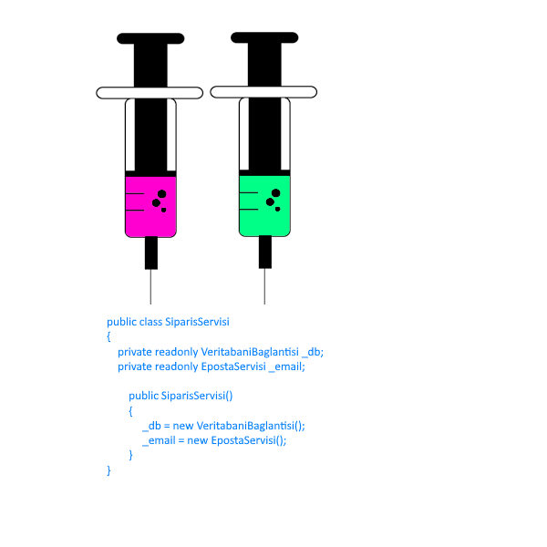              |             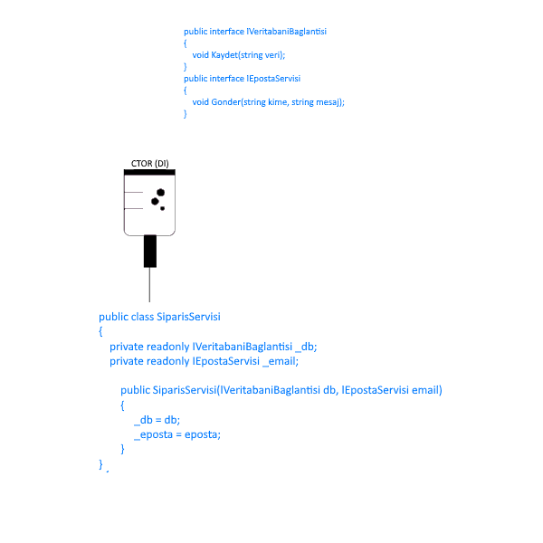             |
| :----------------------------------------------------------: | :----------------------------------------------------------: |
| **Dependencysiz** kullanımda görüldüğü üzere **new** keywordü ile ilgili sınıfın instance'ı oluşturulmak zorunda kalmaktayız. Bu da gerekmediği durumlarda da hem Eposta servisini hem de Veritabanı bağlantısını dahil edecektir ve bu sınıflarda yapılacak her türlü değişiklikte Sipariş Servisi sınıfı bağımlı kalacaktır. | **Dependency Injection** kullandığımız durumu ele alacak olursak, burada sınıf bağımlılığını ortadan kaldırabilmek için Interface'ler oluşturduk ve **Constructor parametreleri** üzerinden ilgili interface'leri dahil ettik. İşte biz bu uyguladığımız işleme **Dependency Injection** demekteyiz. |

- Sınıf içerisinde ihtiyaç olan nesnenin ya constructor'dan ya da setter metoduyla parametre olarak alınması gerektiğini savunur.
- Böylece her iki sınıfı birbirinden izole etmiş olduğumuzu savunmaktadır.

- Dependency Injection, bağımlılıkları soyutlamak demektir.


### IoC (Inversion of Control) Nedir?

Sınıflarımızın bağımlılığını azaltmak için bağımlılıkları Dependency Injection ile dışarıdan alabiliriz demiştik.

- Ancak bazı durumlarda sınıfımız içerisinde çok sayıda arayüze referans vermemiz gerekebilir.
- Bu durumda her biri için dependency injection kodu yazmamız gerekecektir ki bu durum sonunda bir kod karmaşasına neden olacaktır.
- Bunun için bu işlemi otomatikleştirebilen bir yapı kurmamız gerekecektir. Bu yapıya Inversion of Control denmektedir.

#### IoC Çalışma Mantığı

Dependency Injection kullanılarak enjekte edilecek olan tüm değerler/nesneler IoC Container dediğimiz bir sınıfta tutulurlar.

Ve ihtiyaç doğrultusunda bu değerler/nesneler çağırılarak elde edilirler.


#### Asp.Net Core'da IoC Yapılanması

- .NET uygulamalarında IoC yapılanmasını sağlayan third party frameworkler mevcuttur.
  - Structuremap
  - AutoFac
  - Ninject vs..
- Asp.NET Core mimarisi, bu third party kütüphaneler kadar yetenekli olmasa da içerisinde built-in(dahili) olarak IoC Container modülü barındırmaktadır.


#### Asp.Net Core Built-in IoC Container

Built-in IoC Container, içerisine koyulacak değerleri/nesneleri üç farklı davranışla alabilmektedir.

|                          Singleton                           |                            Scoped                            |                          Transient                           |
| :----------------------------------------------------------: | :----------------------------------------------------------: | :----------------------------------------------------------: |
| Uygulama bazlı tekil nesne oluşturur. Tüm taleplere o nesneyi gönderir.<br />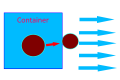 | Her request başına bir nesne üretir ve o request pipeline'nında olan tüm isteklere o nesneyi gönderir.<br />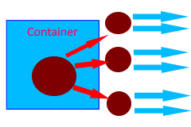 | Her request'in her talebine karşılık bir nesne üretir ve gönderir.<br />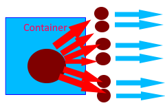 |


### Asp.Net Core Uygulamasında Örnek Servislerin Oluşturulması

Services klasörü altında konsol ve text loglamaya dair iki sınıf oluşturduğumuz bir senaryoyla ilerleyelim.

```csharp
public class ConsoleLog
{
    public void Log()
    {
        
    }
}
```

```csharp
public class TextLog
{
    public void Log()
    {
        
    }
}
```


#### Built-in IoC - IServiceCollection

`Program.cs`

```csharp
//Add services to the container
builder.Services.AddControllersWithViews();
```

> İşte buradaki Services, tanımına gittiğimizde karşımıza IServiceCollection çıkmakta, bu bizim konteynerimiz olacaktır.
>
> Bu sınıfa custom servis ekleyebilmek için aşağıdaki yolu izleyeceğiz.


`Example.cs`

```csharp
public class Example
{
    public Example()
    {
        IServiceCollection services = new ServiceCollection();// built - in IoC
        services.Add(new ServiceDescriptor(typeof(ConsoleLog),new ConsoleLog()));
        services.Add(new ServiceDescriptor(typeof(TextLog),new TextLog()));
        
        ServiceProvider provider = services.BuildServiceProvider(); //Somut container/provider/sağlayıcı
        provider.GetService<ConsoleLog>();
        provider.GetService<TextLog>();
    }
}
```

> `services.Add()` fonksiyonu ile eklenenler default olarak singleton davranışı benimser.
>
> Bu fonksiyonun overload'larını incelersek, 3. parametrede `ServiceLifeTime.Transient` veya `ServiceLifeTime.Scoped` belirleyebilmekteyiz.
>
> Sürekli parametrelerde descriptorlarla, typeof'larla belirtmek yerine,
>
> `services.AddSignleton()` , `services.AddScoped()` , `services.AddTransient` metotlarını kullanmayı tercih edebiliriz.

##### Container'e Eklenen Nesnenin Constructer Parametresiyle Ne Yapılmalı?

```csharp
public class ConsoleLog
{
    public ConsoleLog(int id)
    {
        
    }
    public void Log()
    {
        
    }
}
```

`Program.cs`

```csharp
//services.AddSingleton<ConsoleLog>(); //new T();
services.AddSingleton<ConsoleLog>(p => new ConsoleLog(5)); //Eğer ki constructor parametre alan bir yapıdaysa bu şekilde kullanacağız.

services.AddScoped<ConsoleLog>(p => new ConsoleLog(5));

services.AddTransient<ConsoleLog>(p => new ConsoleLog(5));
```


###### Nesne Bildirimlerinde Uyulması Gereken Abstraction Mantığı

Bunun için bizim benzer işleri yapacak olan sınıflara bir arayüz üzerinden erişmemiz gerekecektir. Haliyle Services içerisine Interfaces klasörü onun altına ilgili bir arayüz oluşturacağız.

```csharp
public interface ILog
{
    public void Log();
}
//
public class ConsoleLog : ILog
{
    public ConsoleLog(int id)
    {
        
    }
    public void Log()
    {
        Console.WriteLine("Console ekranına loglama işlemi gerçekleştirildi.")
    }
}
//
public class TextLog : ILog
{
    public void Log()
    {
        Console.WriteLine("Text dosyasına loglama işlemi gerçekleştirildi.")
    }
}
```

`Program.cs`

```csharp
//services.AddScoped<ILog>(p => new ConsoleLog(5));
//services.AddScoped<ILog>(p => new TextLog());
services.AddScoped<ILog,TextLog>();
```


###### Controller Constructor'ından Nesne Talebinde Nasıl Bulunulur?

> IoC'ye eklenmiş herhangi bir nesneye controller'lar üzerinden nasıl erişilir?

```csharp
public class HomeController : Controller
{
    readonly ILog _log;
	public HomeController(ILog log)
    {
        _log = log;
    }
    
    public ActionResult Index()
    {
        _log.Log();
        return Views();
    }
}
```


###### Action Bazında Nesne Talebinde Nasıl Bulunulur? FromServices Attribute'u

```csharp
public class HomeController : Controller
{
    public ActionResult Index([FromServices]ILog log)
    {
        log.Log();
        return Views();
    }
}
```


###### View'de Nesne Talebinde Nasıl Bulunulur? @inject

```html
@inject ornek_proje.Services.Interface.ILog log

@{
	log.Log();
}

@{
	ViewData["Title"] = "Home Page";
}

<div class="text-center">
    <h1 class="display-4">
        Welcome
    </h1>
    <p>
        Learn about <a href="https://docs.microsoft.com/aspnet/core">building Web apps with ASP.NET Core</a>.
    </p>
</div>
```


## Areas

### Area Nedir? Bir Web Uygulamasında Ne Amaçla Kullanılır?

Web uygulamasında, farklı işlevsellikleri ayırmak için kullanılan özelliktir.

Bu fakrlı işlevsellikler için farklı katmanda, bir route ayarlamamızı sağlayan ve bu katmanda o işleve özel yönetim sergileyen bir yapılanmadır.

- Herbir area, içerisinde View, Controller ve Model katmanı barındırabilir.
- Böylece Asp.NET Core uygulamalarında yönetilebilir küçük ve işlevsel gruplar oluşturulabilir.


### Area Nerelerde Kullanılabilir?

Yönetim Panelleri,
Faturalandırma sayfaları,
İstatistiksel paneller,
İşlevsel modüller,
Uygulamada mantıksal olarak ayrılabilen üst düzey işlevsel bileşenler
vs..

> Area Çok Katmanlı Mimari Değildir!


### Area Oluşturma

Projemizin içerisine `Areas` adında klasör oluşturup sağ tıkladıktan sonra `Add Area`yı seçiyoruz.

Her area kendi içerisinde Controller, View ve Model'e sahiptir, küçük bir web hücresi gibi düşünebilirsiniz.

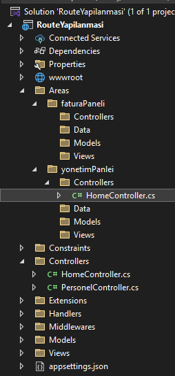

#### Area Attribute'u

Area içerisindeki controller Area Attribute'u ile işaretlenmelidir.
Böylece ilgili alanın uygulamadaki adı resmiyette belirtilmiş olacaktır.
Aksi taktirde farklı area'larda ki controller'lardan aynı isimde olanların çakışma ihtimalleri vardır.

```csharp
[Area("yonetimPaneli")]
public class HomeController : Controller
{
    //..
}
```


#### Area'ya Route Belirleme

Her bir area, içerisindeki controller'lara erişim için farklı bir route sağlamaktadır.
Dolayısıyla bu route'ların tarafımızca tasarlanması gerekmektedir.

`Program.cs`

```csharp
app.MapControllerRoute(
    name : "areaDefault",
    pattern : "{area:exists}/{controller=Home}/{action=Index}/{id?}"); 
```

> exists : Route'un bir area ile eşleşmesi için kısıtlama uygular.


#### MapAreaControllerRoute Fonksiyonu

MapControllerRoute, Default area rotası belirlememizi sağlar.
MapAreaControllerRoute ise bir area'ya ait/özel rota belirlememizi sağlar.

```csharp
app.MapAreaControllerRoute(
	name:"MyArea1",
    areaName:"yonetimPaneli",
    pattern:"yonetim_sayfasi/{controller=Home}/{action=Index}/{id?}"
);
```


#### Area'lar arası Bağlantı Oluşturma

İhtiyaç doğrultusunda area'lar arası bağlantı verilebilmektedir.

##### TagHelpers

```html
<a asp-action="Index" asp-controller="Home" asp-area="yonetimPaneli">Yönetim</a>
```

##### HtmlHelpers

```html
@Html.ActionLink("Yönetim", "Index", "Home", new {area = "yonetimPaneli"})
<a href ="@Url.Action("Index","Controller",new {area = "yonetimPaneli"})">Yönetim</a>
```


#### Area'lar arası Veri Taşıma

Burada tempData kullanabiliriz, örneğin Yönetim panelinden fatura paneline veri gönderip sayfayı da yönlendirirken,

```csharp
[Area("yonetimPaneli")]
public class HomeController : Controller
{
    public IActionResult Index()
    {
        TempData["data"] = "sebepsiz boş yere ayrılacaksan...";
        return RedirectToAction("Index", "Home",new {area="faturaPaneli"}
    );
    }
}

//
[Area("faturaPaneli")]
public class HomeController : Controller
{
    public IActionResult Index()
    {
        var data = TempData["data"];
        return View();
    }
}
```


## ViewModel & DTO

### ViewModel Nedir?

ViewModel, temelde iki farklı senaryoya karşılık sorumluluk üstlenen ve biz yazılım geliştiricilerin işini kolaylaştıran operasyonel nesnelerdir.

 	1. Senaryo
 	 OOP yapılanmasında bir modelin kullanıcıyla etkileşimi neticesinde kullanılan ve esas datanın memberlarını temsil eden ve süreçte ilgili model yerine veri taşıma/transfer operasyonunu üstlenen nesnelerdir.
 	2. Senaryo
 	 Birden fazla modeli/değeri/veriyi tek bir nesne üzerine birleştirme görevi gören nesnedir.


### DTO(Data Transfer Object) Nedir?

Herhangi bir davranışı olmayan ve uygulamanın çeşitli yerlerinde yalnızca bir veri tüketimi ve iletimi için kullanılan, veritabanındaki herhangi bir verinin transfer nesnesidir/karşılığıdır/görünümüdür.


### ViewModel - DTO Nesne Karşılaştırması

| ViewModel                                                    | DTO                                                          |
| :----------------------------------------------------------- | :----------------------------------------------------------- |
| • Kullanıcıya sunulacak verinin view'e uygun/view'in beklediği şekilde tasarlanmış modelidir.<br />• Veriyi görünüm/sunum/presentation için anlamlı hale getirir.<br />• İşlevsel fonksiyonlar(metot) barıdırabilir.<br />• İçerisinde bir veya birden fazla DTO temsil edebilir.<br />• DTO'ya nazaran daha karmaşıktır. | • Bir verinin(genellikle veritabanından gelen verinin) transfer modellemesidir. Transfer edilecek olan ilgili verideki sadece ihtiyaç olunan dataları temsil eder.<br />• Görünüm/sunum/presentation için kullanılabilir lakin bunun dışında uygulamanın herhangi bir katmanında çeşitli veri tüketimi ve transferi içinde kullanılmaktadır.<br />• Herhangi bir fonksiyonellik barındırmaz.<br />• Salt veriyi temsil eder. |

> Kullanıcıya sunulan hiçbir veri direkt olarak veritabanındaki entity türündne olmamalıdır.
> Bu tarz durumlarda ViewModel kullanılmalıdır.


#### Senaryo 1 - Bir Model'in View'deki Etkileşimine Uygun Parçasını Temsil Etme

```csharp
using Microsoft.AspNetCore.Mvc;
using viewModelExample.Models;
using viewModelExample.Models.ViewModels;

namespace viewModelExample.Controllers
{
    public class PersonelController : Controller
    {
        public IActionResult Index()
        {
            return View();
        }
        [HttpPost]
        public IActionResult Index(PersonelEkleVM personelEkleVM)
        {
            return View();
        }

        public IActionResult Listele()
        {
            List<PersonelListeVM> personeller = new List<Personel>
            {
                new Personel { Adi = "A", Soyadi = "B", Maas = 5000, MedeniHali = true, Pozisyon = "Developer" },
                new Personel { Adi = "C", Soyadi = "D", Maas = 6000, MedeniHali = false, Pozisyon = "Tester" },
                new Personel { Adi = "E", Soyadi = "F", Maas = 7000, MedeniHali = true, Pozisyon = "Manager" }
             
            }.Select(p => new PersonelListeVM
            {
                Adi = p.Adi,
                Soyadi = p.Soyadi,
                Pozisyon = p.Pozisyon
            }).ToList();

            return View(personeller);
        }
    }
}
```

`View: PersonelEkle`

```html
@model PersonelEkleVM

<form asp-action="Index" asp-controller="Personel" action="/" method="post">
    <input type="text" asp-for="Adi"/></<br />
    <input type="text" asp-for="Soyadi" /><br />
    <button>Gönder</button>
</form>
```

`View: PersonelListele`

```html
@model List<Personel>

<ul>
    @foreach (var item in Model)
    {
        <li>@item.Adi @item.Soyadi @item.Pozisyon</li>
    }
</ul>
```


`Entity (DB)`

```csharp
namespace viewModelExample.Models
{
    public class Personel
    {
        //Entity Model
        public int Id { get; set; }
        public string Adi { get; set; }
        public string Soyadi { get; set; }
        public string Pozisyon { get; set; }
        public int Maas { get; set; }
        public bool MedeniHali { get; set; }
    }
}

```

`ViewModels`

```csharp
namespace viewModelExample.Models.ViewModels
{
    public class PersonelEkleVM
    {
        //ViewModel'da sadece taşınacak verinin propertyleri temsil edilir.
        public string Adi { get; set; }
        public string Soyadi { get; set; }
    }
}

```

```csharp
namespace viewModelExample.Models.ViewModels
{
    public class PersonelListeVM
    {
        public string Adi { get; set; }
        public string Soyadi { get; set; }
        public string Pozisyon { get; set; }
    }
}
```


#### Senaryo 2 -  Birden Fazla Nesneyi Tek Bir Nesneye Bağlama

```csharp
public IActionResult Get()
{
    var nesne = (new Personel(), new Musteri(), new Urun());
    return View();
}
```

Bu şekilde Tuple ile birden fazla nesneyi tek bir nesneye bağlayabilmemiz yanı sıra bu işlemi ViewModel ile de gerçekleştirebilmekteyiz.

```csharp
public class XVM
{
    public Personel Personel {get; set;}
    public Urun Urun {get; set;}
    public Musteri Musteri {get; set;}
}
```


### Sözleşme/Kontrat Mantığı Nedir?

- Backend'de üretilen bir verinin client'a gönderilmesi için tasarlanan ViewModel o işlemin sözleşmesi/kontratı olmaktadır.
- Haliyle Backend'den gelecek datayı client'ın uygun formatta karşılayabilmesi için kesinlikle o türden bir nesne oluşturması gerekecektir.


### ViewModel'lar da Validation Durumları

- Kullanıcıdan alınan veriler iş kuralı gereği kontrol edilebilirler. Bizler bu kontrollere validation diyoruz.
- Kullanıcılardan gelen veriler kesinlikle veritabanı tablolarının karşılığı olan entity modelleri olmalıdır! ViewModel olarak alınmalıdır! Ve tüm validation'lar bu ViewModel nesneleri üzerinde gerçekleştirilmelidir.


### ViewModel'ı Entity Model'a Nasıl Dönüştürebiliriz?

Kullanıcıdan gelen dataları ViewModel ile karşıladıktan sonra bu ViewModel'da ki verileri veritabanına kaydetmek isteyebiliriz. Bu durumda, bu verileri Entity Model'a dönüştürmemiz gerekecektir. Bunun için aşağıdaki yöntemlerden herhangi biri kullanılabilir:


#### Manuel Dönüştürme

```csharp
[HttpPost]
public IActionResult Index(PersonelEkleVM personelEkleVM)
{
    Personel p = new Personel()
    {
        Adi = personelEkleVM.Adi,
        Soyadi = personelEkleVM.Soyadi
    };
    //...
    return View();
}

```


#### Implicit Operator Overload ile Dönüştürme

```csharp
namespace viewModelExample.Models
{
    public class Personel
    {
        //Entity Model
        public int Id { get; set; }
        public string Adi { get; set; }
        public string Soyadi { get; set; }
        public string Pozisyon { get; set; }
        public int Maas { get; set; }
        public bool MedeniHali { get; set; }
        
        #region implicit/Gizli/Bilinçsiz
        public static implicit operator PersonelEkleVM(Personel model)
        {
            return new PersonelEkleVM
            {
                Adi = model.Adi,
                Soyadi = model.Soyadi
            }
        }
        public static implicit operator Personel(PersonelEkleVM model)
        {
            return new Personel
            {
                Adi = model.Adi,
                Soyadi = model.Soyadi
            };
        }
            #endregion
    }
}
```

```csharp
[HttpPost]
public IActionResult Index(PersonelEkleVM personelEkleVM)
{
    #region Implicit
        
    Personel p = PersonelEkleVM;
    PersonelEkleVM vm = personel;
    
    #endregion
    PersonelEkle
    //...
    return View();
}
```


#### Explicit Operator Overload ile Dönüştürme

```csharp
namespace viewModelExample.Models
{
    public class Personel
    {
        //Entity Model
        public int Id { get; set; }
        public string Adi { get; set; }
        public string Soyadi { get; set; }
        public string Pozisyon { get; set; }
        public int Maas { get; set; }
        public bool MedeniHali { get; set; }
        
        #region explicit/Açık/Bilinçli
        public static explicit operator PersonelEkleVM(Personel model)
        {
            return new PersonelEkleVM
            {
                Adi = model.Adi,
                Soyadi = model.Soyadi
            }
        }
        public static explicit operator Personel(PersonelEkleVM model)
        {
            return new Personel
            {
                Adi = model.Adi,
                Soyadi = model.Soyadi
            };
        }
            #endregion
    }
}
```

```csharp
[HttpPost]
public IActionResult Index(PersonelEkleVM personelEkleVM)
{
    #region Implicit
        
    Personel p = (Personel)PersonelEkleVM;
    PersonelEkleVM vm = (PersonelEkleVM)personel;
    
    #endregion
    PersonelEkle
    //...
    return View();
}
```


#### Reflection ile Dönüştürme

```csharp
//Business
public static class TypeConversion
{
    public static T Conversion<T,TResult>(T model) where TResult : class, new()//Nesne oluturulabilir class tanımı
    {
        TResult result = new TResult();
        typeof(T).GetProperties().ToList().ForEach(p => 
    	{
            PropertyInfo property = typeof(TResult).GetProperty(p.Name);
            property.SetValue(result,p.GetValue(model));
        });
        
        return result;
    }
}
```


```csharp
[HttpPost]
public IActionResult Index(PersonelEkleVM personelEkleVM)
{
    #region Reflection
	Personel p = TypeConversion.Conversion<PersonelEkleVM, Personel>(personelEkleVM);
    PersonelListeVM vm = TypeConversion.Conversion<Personel, PersonelListeVM>(new Personel {Adi = "asdasd", Soyadi = "qweqwe"});
    #endregion
    PersonelEkle
    //...
    return View();
}
```


#### AutoMapper Kütüphanesi ile Dönüştürme 

> PM> Install-Package AutoMapper -Version 10.1.1
>
> Projemize ekledikten sonra, AutoMappers adında bir klasör altında Profil sınıfları oluşturmalıyız ve ilgili kütüphane servisini Startup.cs'de Configure'e veyahut Program.cs'de eklemeliyiz.

```csharp
using AutoMapper;
using viewModelExample.Models;
using viewModelExample.Models.ViewModels;

namespace viewModelExample.AutoMappers
{
    public class PersonelProfil : Profile
    {
        public PersonelProfil()
        {
            CreateMap<Personel, PersonelEkleVM>();
            CreateMap<PersonelEkleVM, Personel>();
        }
    }
}

```

`Program.cs`

```csharp
builder.Services.AddAutoMapper(typeof(PersonelProfil));
```

Bu sınıfı controller'da kullanabilmek için IMapper arayüzünü çağırmamız gerekmektedir.

```csharp
using AutoMapper;
using Microsoft.AspNetCore.Mvc;
using viewModelExample.Models;
using viewModelExample.Models.ViewModels;

namespace viewModelExample.Controllers
{
    public class PersonelController : Controller
    {
        public PersonelController(IMapper mapper)
        {
            Mapper = mapper;
        }

        public IMapper Mapper { get; }

        public IActionResult Index()
        {
            return View();
        }
        
        [HttpPost]
        public IActionResult Index(PersonelEkleVM personelEkleVM)
        {
            #region AutoMapper
                
			Personel p = Mapper.Map<Personel>(personelEkleVM);
            PersonelEkleVM vm = Mapper.Map<PersonelEkleVM>(p);
            
            #endregion
                
                //...
            return View();
        }
    }
}
```


## Konfigürasyon Yapılanması

### appsettings.json Dosyası Nedir?

Asp.Net Core uygulamalarında yapılandırma araçlarından birisidir.

> Yapılandırma, bir uygulamanın herhangi bir ortamında gerçekleştireceği davranışlarını belirlememizi sağlayan statik değerin tanımlanmasıdır.
>
> Eski Asp.Net uygulamalarında kullanılan web.config yahut Global.asax gibi dosyalar standart framework'ün yapılandırmasında kullanılan ortamlardı.


#### Best Practices

Best practices açısından kodun içerisine username, password, connection string vs. gibi statik tanımlamalar yapılmamalıdır!

#### Asp.NET Core'da ki appsettings.json Dışındaki Yapılandırma Araçları Nelerdir?

- Appsettings.json | appsettings.{Enviroment}.json
- Secrets.json (Secret Manager Tools)
- Enviroment Variables


#### appsettings.json Dosyasının Asp.NET Core Uygulamasındaki Davranışı

appsettings veya .{Enviroment}.json türevleri Program.cs içerisinde default olarak ayağa kaldırılmaktadır.
Eğer ki biz bunun yerine farklı bir konfigürasyon uygulansın istersek,

`Program.cs`

```csharp
builder.Configuration
    .AddJsonFile("appsettings1.json", optional: false, reloadOnChange: true)
    .AddJsonFile("appsettings1.{builder.Enviroment.EnviromentName].json", optional: true, reloadOnChange: true);
```

olarak tanımlayabilmekteyiz.

### appsettings.json Konfigürasyonu

#### Veri Ekleme

```json
//Default konfigürasyon
{
    "Logging":{
        "LogLevel":{
            "Default":"Information",
            "Microsoft":"Warning",
            "Microsoft.Hosting.Lifetime":"Information"
        }
    },
    "AllowedHosts": "*",
    //---//
    "OrnekMetin": "sebepsiz boş yere ayrılacaksan..",
    "Person" : {
        "Name" : "Mustafa",
        "Surname" : "Kurt"
    }
}
```


#### Veri Okuma

##### IConfiguration Arayüzü

Asp.NET Core IoC provider'ında bulunan bir servistir.

Bu servis uygulamadaki appsettings.json dosyasını okumakta ve içerisindeki value'ları bizlere getirmektedir. Dolayısıyla IoC'den bu servisi
herhangi bir controller'da dependency Injection ile talep edebilir ve appsettings.json dosyasındaki konfigürasyonları kullanabiliriz.

```csharp
public class HomeController : Controller
{
    readonly IConfiguration _configuration;
    public HomeController (IConfiguration configuration)
    {
        _configuration = configuration;
    }
    
    //..
}
```


##### Indexer ile Veri Okuma

> ':' Operatörü Json içerisindeki alanların alt katmanlarına inmemizi sağlamaktadır.

```csharp
public class HomeController : Controller
{
    readonly IConfiguration _configuration;
    public HomeController (IConfiguration configuration)
    {
        _configuration = configuration;
    }
    
    public IActionResult Index()
    {
        var value1 = _configuration["OrnekMetin"];
        var value2 = _configuration["Person"];
        var value3 = _configuration["Person:Name"];
        var value4 = _configuration["Person:Surname"];
        var value5 = _configuration["Logging:LogLevel:Microsoft.Hosting.Lifetime"];
        //Runtime'da bu veriler gidipte appsettings.json'dan okumuyor, in-memory'den okuyor.
        return View();
    }
}
```


##### GetSection Metodu ile Veri Okuma

```csharp
public class HomeController : Controller
{
    readonly IConfiguration _configuration;
    public HomeController (IConfiguration configuration)
    {
        _configuration = configuration;
    }
    
    public IActionResult Index()
    {
        var value6 = _configuration.GetSection("Person");
        var value7 = _configuration.GetSection("Person:Name");
        value7.Value;//Değeri getirir
        return View();
    }
}
```


###### Get Metoduyla Verileri Uygun Nesneyle Eşleştirme

`Model`

```csharp
public class Person
{
    public string Name {get; set;}
    public string Surname {get; set;}
}
```


```csharp
public class HomeController : Controller
{
    readonly IConfiguration _configuration;
    public HomeController (IConfiguration configuration)
    {
        _configuration = configuration;
    }
    
    public IActionResult Index()
    {
        var value8 = _configuration.GetSection("Person").Get(typeof(Person));
        return View();
    }
}
```


#### Environment'e Göre appsettings.json Dosyası Ayarlama

Environment, Asp.Net Core uygulamasının runtime'daki davranışını belirleyen değişkenleri kapsayan bir konu.
Bu değişkenler sayesinde bizler, uygulamamızın çalışma ortamını belirleyebilmekteyiz ve ortamdan ortama göre farklı değişkenler/parametreler devreye sokabilmekteyiz.

Projemize sağ tıklayıp 'Properties' dediğimizde karşımıza konfigürasyon yapabildiğimiz bir sayfa gelmekte, Debug penceresini açtığımızda ise Environment variables yer almaktadır.
Genellikle value olarak `Development`,`Production`,`Staging` olarak değer verilmektedir.


Detaylarını ilerleyen süreçte ilgili başlık altında tekrar ele alacağız.

appsettings.json tüm ortamlarda ortak erişilebilir tanımları barındırırken, appsettings.{environment}.json ise sadece ilgili environment ortamına erişim yapmamızı sağlar.


### Options Pattern ile Konfigürasyonları Dependecy Injection ile Yapılandırma

`appsettings.json`

```json
"MailInfo" : 
{
    "Port" : "587",
    "Host" : "smtp.gmail.com",
    "EmailInfo" :{
        "Email" : "trukafatsum@gmail.com",
        "Password" : "Q124ASF52"
    }
}
```

`Controller`

```csharp
public class MailController : Controller
{
    readonly IConfiguration _configuration;
    
    public MailController (IConfiguration configuration)
    {
        _configuration = configuration;
    }
    
    public IActionResult SendMail()
    {
        string host = _configuration["MailInfo:Host"];
        string port = _configuration["MailInfo:Port"];
        
        MailInfo mailInfo = _configuration.GetSection("MailInfo").Get<MailInfo>();
        
        return View();
    }
}
```

`Model`

```csharp
public class MailInfo
{
    public string Port {get; set;}
    public string Host {get; set;}
    public EmailInfo EmailInfo {get; set;}
}
public class EmailInfo
{
    public string Email {get; set;}
    public string Password {get; set;}
}
```

Normalde yukarıdaki şekilde bir yapı kurgulayabildiğimizi önceki konu başlıklarında ele aldık. Lakin konfigürasyonel olarak belirli olarak kullanacağımız değerleri Dependency injection kullanarak nesnel olarak elde edebilmek için Options Pattern kullanmayı tercih edeceğiz.

> Options Pattern, appsettings.json dosyadaki konfigürasyonları Dependency Injection ile kullanmamızı sağlayan ve yapılandırılmış olan nesnel modellerle ilgili konfigürasyonları temsil etmemizi sağlayan bir tasarım desenidir.

 IoC Container'da servis olarak bu konfigürasyonu vereceğiz,

`Program.cs`

```csharp
builder.Services.Configure<MailInfo>(builder.Configuration.GetSection("MailInfo"));
```

Bu vakitten sonra yapmamız gereken tek şey, controller'ın constructor'u üzerinden Microsoft.Extensions.Options kütüphanesindeki IOptions ile ilgili servisimizi/konfigürasyonumuzu dahil etmek olacaktır.

```csharp
public class MailController : Controller
{
    MailInfo _mailInfo;
    
    public MailController (IOptions<MailInfo> mailInfo)
    {
        _mailInfo = mailInfo.Value;
    }
    
    public IActionResult SendMail()
    {
        //string host = _configuration["MailInfo:Host"];
        //string port = _configuration["MailInfo:Port"];
        
        //MailInfo mailInfo = _configuration.GetSection("MailInfo").Get<MailInfo>();
        _mailInfo;
        return View();
    }
}
```


### Secret Manager Tools ile Hassas Verilerin Korunması

#### Secret Manager Tools Nedir?

Web uygulamalarında development ortamında kullandığımız bazı verilerimizin canlıya deploy edilmesini istemeyebiliriz.

Bu verilerimiz;

- Veritabanı bilgilerini barındıran connection string bilgisi,
- Herhangi bir kritik arz eden token değeri,
- Facebook veya Google gibi third party authentication işlemleri yapmamızı sağlayan client scret id değerleri vs..

Bu veriler developer ortamında kullanılırken, production ortamında kötü niyetli kişilerin uygulama dosyalarına erişim sağladıkları durumlarda elde edemeyecekleri vaziyette bir şekilde ezilmeleri gerekmektedir.

İşte bunun için Secret Manager Tools geliştirilmiştir.


#### SMT Çalışma Mantığı

Artık risk arz eden dosyalarımızı secret manager tools kullanarak `appsettings.json` yerine `secret.json` da tutacağımızı anladıktan sonra, çalışma mantığında ise bu dosyalar geliştirici olarak bizlerin bilgisayar üzerinde `C:\\Users\...\AppData\Roaming\Microsoft\UserSecrets\{SecretsId}\secret.json` adlı bir klasörde şifrelenerek tutulmakta ve environment ortamı development iken, bu dosya ile path'ı gizlenmekte olacak, haliyle build edildiğinde ilgili `secret.json` proje kök dizininde yer almayacak ve veri güvenliği sağlanmış olacaktır.


#### Secret Manager Kullanımı

VS editör üzerinde projeye sağ tıkladığımızda, Manage User Secrets adında bir sekmek bulunmakta, buna tıkladığımızda `secret.json` dosyamız açılmış olacaktır. 

Projeye çift tıkladığımızda ise, burada `<UserSecretsId> e34977c7-9110-46e0-a2d5-8f83267a4989</UserSecretsId>` olarak bir değer atandığını görebilmekteyiz. İşte çalışma mantığında bahsettiğimiz bu SecretsId, ilgili secret.json'un klasör adı olacaktır.


#### Konfigürasyonel Yapılanmalardaki Yaşam Döngüsü Nasıldır?

IConfiguration arayüzü ile herhangi bir aramada bulunduğumuzda, bu `appsettings.json` 'dan ilgili veriyi bizlere getiriyordu, işte bu yaşam döngüsünde
ilk olarak `Enviroment`'a bakar ardından `Secret.json`'a bakar son olarak bulamadıysa `appsettings.json`'a bakar ve veriyi bizlere getirir. Options Pattern yapılanmalarıda aynı şekilde olacaktır.


#### `secret.json` Veri Okuma

Secret.json ile veri okuma yine aynı olacaktır, controller üzerinde IOptions ile veyahut IConfiguration arayüzü ile ilgili değerleri aynı şekilde getirmekteyiz.

Peki her ikisinde de aynı türde, aynı key'e karşılık gelen veri yer alıyorsa hangisini getirecektir diye soracak olursak, elbetteki yaşam döngüsünde ilk tetikleneni getirecektir. Haliyle aynı tür hem `appsettings.json`da hem de `secret.json` da yer alıyorsa, ilk önce `secret.json` a baktığı için ilgili veriyi `secret.json` dan getirecektir.


Production ortamında ise bizler bu kritik arz eden değerleri Environment Variables olarak vereceğiz.


### Environment

#### Environment Nedir?

- Bir web uygulamasında, uygulamanın bulunduğu aşamalara dayalı, davranışı kontrol etmek ve yönlendirmek isteyebiliriz.
- İşte bunun için Environment dediğimiz ortamlar mevcuttur.
  - Geliştirme Ortamı : Development
  - Test Ortamı : Staging
  - Son kullanıcı (Ürün) Ortamı : Production


#### Environment Variables

Asp.NET Core uygulamalarının runtime'da ki davranışını belirlememizi sağlayan değişkenlerdir.


##### ASPNETCORE_ENVIRONMENT Nedir?

İlgili uygulamanın, hangi ortamda ayağa kalkacağını ifade eden Environment değişkenidir.


#### IWebHostEnvironment Arayüzü ile Runtime Environment Ortamına Erişim

IWebHostEnvironment arayüzü ile instance oluşturduğumuzda, bu instance üzerinden `IsDevelopment()`, `IsStaging()`, `IsProduction()` ve `IsEnvironment()` metotlarını çağırabilmekteyiz. Haliyle geliştirdiğimiz ortama göre karar yapılarıyla yönlendirmemiz kolaylaşmaktadır.


#### Environment Değişkenlerin secret.json ve appsettings.json Dosyalarını Ezmesi

Birkaç başlık öncesinde bahsettiğimiz üzere, yaşam döngüsü Environment > Secret.Json > Appsettings.Json olarak sırasıyla ilerlemekte, haliyle aynı türden girilmiş olan değişkenlerde ilk Environment kontrol edileceği için, diğerlerini ezmiş olacaktır.


#### .cshtml'de Environment Kontrolü

TagHelper sayesinde bizler hangi ortamda çalışıyorsak bunları .cshtml'de kontrol edebilmekteyiz.

```html
<environment name="Development,Staging">
	Geliştirme veya Test ortamındayız..
</environment>
```

---


## Kaynakça

[Youtube : Özel Ders Formatında A'dan Z'ye Asp.NET Core 5.0 Web Programlama Eğitimi](https://www.youtube.com/playlist?list=PLQVXoXFVVtp33KHoTkWklAo72l5bcjPVL)

[NgAkademi : Asp.NET Core 5.0 Web Programlama Eğitimi - Gençay Yıldız](https://ngakademi.com/courses/ozel-ders-formatinda-adan-zye-asp-net-core-5-0-web-programlama-egitimi/)

